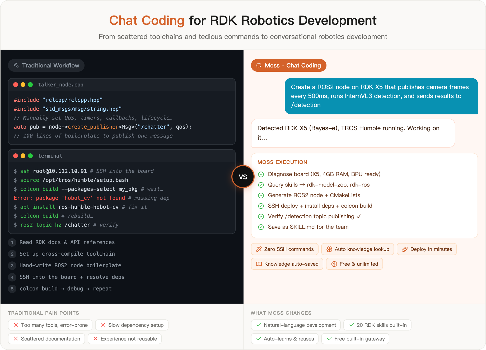
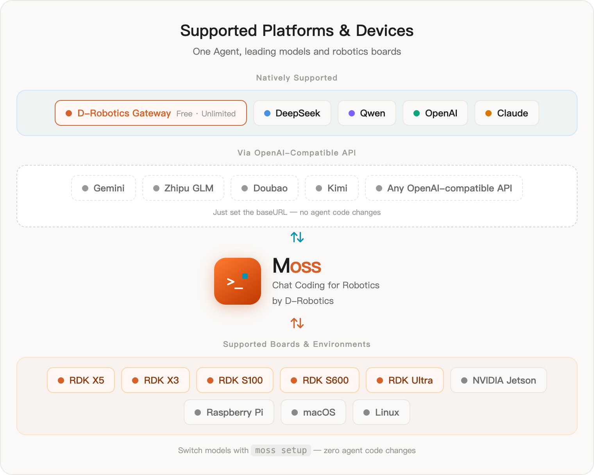
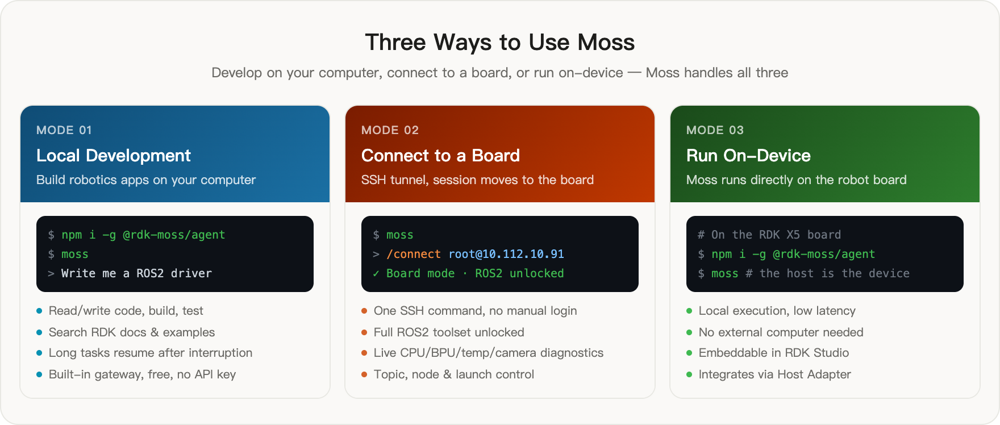

<div align="center">


# Moss

**A cross-platform agent harness for daily coding & office work — robotics as skills**

Built by [D-Robotics (地瓜机器人)](https://developer.d-robotics.cc)

[](https://www.npmjs.com/package/@rdk-moss/agent)
[](https://www.npmjs.com/package/@rdk-moss/core)
[](./LICENSE)
[](https://nodejs.org)

**English** | [简体中文](./README_CN.md)

</div>

---

Moss is a general-purpose, cross-platform agent harness by D-Robotics. It runs on Linux, Windows, and macOS and helps you with everyday work — writing and reviewing code, documents, automation, and more — by understanding intent, planning steps, running tools, and reporting each one back. Describe what you want in plain language; Moss does the work, every step visible, interruptible, and resumable.

Robotics and edge-device capabilities (RDK boards, ROS2, peripherals, board diagnostics, Jetson/Raspberry Pi knowledge) are available as **pluggable skills** — one capability area among many, not the whole product. moss stays a small, general-purpose core; robotics arrives through the skill layer and the `/connect` board session.

Moss is also a **platform for building your own agent**: bring your own persona (`soul.md`), skills (`SKILL.md`), tools (builtin / MCP / `agent.tools.register`), model, and automation (`/goal`, `/loop`), or embed the core as a library. See [packages/moss-agent/EXTENDING.md](./packages/moss-agent/EXTENDING.md) for the full extension surface.

**Works out of the box, no API key.** The first launch already talks to the built-in D-Robotics gateway — free and unlimited.

<p align="center">
  
</p>

---

## What Chat Coding replaces

Whether it is ordinary software or a board bring-up, the chain is the same: read docs, configure toolchains, hand-write boilerplate, run and fix, rebuild over and over — every step on you. Moss compresses that chain into one sentence: you describe the goal, the agent plans and executes.

<p align="center">
  
</p>

---

## Core capabilities

**💬 Chat Coding — general purpose**
Describe a task in natural language; Moss understands the intent, plans the steps, runs the tools (files, shell, search, web), and reports each one back. Not a chat box — an agent that actually does the work, on any project.

**🤖 Robotics as skills**
20 built-in skill packs (SKILL.md) covering model deployment, TROS/ROS2, peripheral drivers (GPIO/I2C/SPI), board diagnostics, plus Jetson and Raspberry Pi platform knowledge. They load automatically when relevant — Moss understands RDK from the first run, without making robotics the whole product.

**🔌 No model lock-in**
The built-in gateway is free; natively supports DeepSeek, Qwen, OpenAI, Claude (Anthropic), and any OpenAI-compatible endpoint — Gemini, Zhipu GLM, Doubao, Kimi, etc. all work through the compatible interface. Switch with one `moss setup`, zero agent changes.

**🔗 Seamless device connection**
`/connect root@192.168.1.10` moves the whole session onto a board. SSH tunneling; the full ROS2 toolset (topics, nodes, launch, packages) and device diagnostics (temperature, BPU load, camera status) unlock automatically.

**🧠 Learns as it works**
Moss observes while executing; after a session it distills the successful flow into a skill candidate — confirm with `/skills promote` to save it as SKILL.md. Reuse it next time you hit the same problem — team knowledge accumulates naturally, no manual documentation.

**⏸ Resumable long tasks**
Every step auto-saves. Interrupted tasks (Ctrl-C, network drop, shutdown) don't lose progress — `moss resume --last` continues exactly where you left off. Long-horizon goals survive restarts.

**🛡 Honest by design**
Separates verified facts from inference, reports unavailable capabilities, never fakes a result it didn't check. Every tool call goes through an approval gate, so you stay in control.

---

## Supported models & platforms

<p align="center">
  
</p>

**Natively supported models**: D-Robotics Gateway (free · unlimited) · DeepSeek · Qwen · OpenAI · Claude (Anthropic)

**Via OpenAI-compatible API**: Gemini · Zhipu GLM · Doubao · Kimi · any OpenAI-compatible API

**Boards & environments**: RDK X5 · RDK X3 · RDK S100 · RDK S600 · RDK Ultra · NVIDIA Jetson · Raspberry Pi · macOS · Linux

---

## Quick start

**Prerequisites**: Node.js >= 22.16 and a terminal. (An RDK board is optional.)

```bash
# Install
npm i -g @rdk-moss/agent@latest

# Start (works immediately — no key, no login)
moss

# One-shot: answer and exit
moss "review the code structure of this project"

# Piped stdin also works
echo "write me a ROS2 topic listener node" | moss
```

Inside the TUI, press **Shift+Tab** to cycle interaction modes:

| Mode | Behavior |
|------|----------|
| `plan` | Read-only planning, executes nothing |
| `default` | Prompts for approval on each tool call (recommended to start) |
| `accept-edits` | Auto-runs file edits and commands (bounded only by the deny list and read-only ceiling) |

Type `@` to attach files inline, or `/help` for the full command reference.

---

## Three ways to use Moss

<p align="center">
  
</p>

### Mode 1 — Local development

Build robotics apps right on your computer; Moss reads/writes code, searches docs, and verifies builds:

```bash
moss
> write a ROS2 node that subscribes to /camera/image_raw and runs edge detection with OpenCV
```

Good for: writing ROS2 nodes, debugging Python scripts, searching official RDK examples, code review.

### Mode 2 — Connect to a board

SSH tunneling moves the session onto the board; ROS2 and diagnostics unlock automatically:

```bash
/connect root@192.168.1.10              # password login (entered interactively)
/connect root@192.168.1.10 --key ~/.ssh/id_rsa   # key-based login
/connect root@192.168.1.10 --hybrid     # keep local tools too
/disconnect                              # leave, back to local mode
```

After connecting, Moss detects the board model, OS version, and TROS status, then unlocks:

- **ROS2 tools**: `ros2_topic_list` / `ros2_topic_echo` / `ros2_topic_hz` / `ros2_node_list` / `ros2_service_list` / `ros2_service_call` / `ros2_launch` / `ros2_pkg_list`
- **Device diagnostics**: `device_temperature` / `device_resources` / `device_processes` / `device_network` / `device_cameras`
- **Remote execution**: `device_exec` / `device_file_read` / `device_file_list`

### Mode 3 — Run on-device

Install and run Moss directly on an RDK board, no external computer needed:

```bash
# On the board
npm i -g @rdk-moss/agent@latest
moss
```

Good for: edge debugging, on-robot autonomous tasks, embedding into RDK Studio as an Agent module.

---

## Built-in RDK skills

Moss ships the open [**device-knowledge**](https://github.com/D-Robotics/device-knowledge) pack — 20 `SKILL.md` files that load automatically, no setup:

| Skill | Covers |
|-------|--------|
| `rdk-llm-deployment` | On-device LLM/VLM deployment (hobot_llamacpp / InternVL / Qwen) |
| `rdk-model-zoo` | Official prebuilt model lookup, download & deployment |
| `rdk-ros` | TROS / ROS2 node catalog, topic mapping, perception |
| `rdk-device` | Model quantization (hb_mapper / hb_compile), BPU deployment |
| `rdk-peripheral-cookbook` | GPIO / I2C / SPI peripheral programming |
| `rdk-multimedia` | Cameras, codecs, multimedia pipelines |
| ...20 in total | Board knowledge, system config, doc finder, embodied/LeRobot, Jetson/Raspberry Pi, and more |

**Add your own skills**: drop a `SKILL.md` in the project's `.moss/skills/` directory and Moss loads it on startup:

```bash
.moss/skills/my-robot-setup/SKILL.md
```

You can also point Moss at extra global skill directories in config:

```json
// .moss/config.json
{ "skills": { "extraRoots": ["~/.claude/skills", "/path/to/shared/skills"] } }
```

**Team knowledge base**: skill candidates Moss learns are promoted via `/skills promote`, then shared through a team skill directory (configured via `skills.extraRoots`) so successful runs are reusable across the team.

---

## Switch models & providers

```bash
moss setup          # interactive: choose provider, paste the API key
moss auth status    # show the resolved provider, model, and key source
```

Resolution priority (high → low):

```
CLI flags / -c key=value
  → project .moss/config.json
  → config saved by moss setup
  → built-in D-Robotics gateway (default, no setup)
```

> **Note**: Moss deliberately ignores environment variables like `OPENAI_API_KEY`, so a key exported for another tool never silently changes your agent's provider.

---

## Long tasks & resume

Moss auto-saves every session. Interrupted tasks aren't lost:

```bash
moss resume --last        # continue the most recent session
moss --continue           # continue the most recent session in place
moss resume <session-id>  # resume a specific session
moss sessions             # list all saved sessions
```

Set a long-horizon goal and Moss runs autonomously until it's met:

```bash
/goal deploy InternVL3 on the RDK X5 and pass the performance benchmark
```

A run that hits the turn limit is paused, not failed — the Agent tells you how to resume.

---

## Command reference

| Command | Purpose |
|---------|---------|
| `moss` | Start the interactive session |
| `moss "a task"` | One-shot: answer and exit |
| `moss resume --last` | Continue the most recent session |
| `moss setup` | Configure model & provider |
| `moss auth status` | Show current auth state |
| `moss doctor` | Health-check (config, connection, tools, MCP) |
| `/connect <ip>` | Connect an RDK board, enter board mode |
| `/disconnect` | Leave board mode, restore local tools |
| `/status` | Show current session state |
| `/model` | Switch the model for this session |
| `/goal <condition>` | Set a goal, run until it's met |
| `/diff` · `/review` | Show changes · review for bugs |
| `/compact` | Compress history, save tokens |
| `/skills` | View skills · `promote` a learned candidate |
| `/help` | Full command list |

---

## Architecture

A TypeScript / ESM / npm-workspaces monorepo (Node.js >= 22.16). Built around a clear **host boundary**:

```
User (TUI / CLI / embedded SDK)
        ↕
Moss Agent Core          ← agent loop + goal runner
  ├─ Tool framework      ← ~30 core + ~17 device tools (on connect)
  ├─ Context & memory    ← compaction, persistence, retrieval
  ├─ Skill system        ← SKILL.md registry & learning
  └─ Safety & approval   ← layered confirmation
        ↕ Host Adapter contract
Model gateway / RDK board / device-knowledge
```

| Package | npm | Role |
|---------|-----|------|
| `packages/moss` | `@rdk-moss/core` | Core contracts (KnowledgeModule, Host Adapter, prompts). Zero host dependencies. |
| `packages/moss-agent` | `@rdk-moss/agent` | Runtime + `moss` CLI (agent loop, tools, memory, skills, safety). |
| `packages/create-moss-app` | `create-moss-app` | Project scaffolding (`minimal` / `openai` templates). |

**Embed Moss in your product**:

```bash
npx create-moss-app my-host
```

```ts
import {
  MOSS_HOST_ADAPTER_CONTRACT_VERSION,
  evaluateMossHostCompatibility,
  type MossHostRuntimeManifest,
} from '@rdk-moss/core/contracts/host-adapter';
```

A host registers its providers/tools/storage/approval gates, publishes a `MossHostRuntimeManifest`, and runs `evaluateMossHostCompatibility()` in CI before adopting a release. See [`docs/host-adapter-contract.md`](./docs/host-adapter-contract.md).

---

## Contributing

```bash
git clone https://github.com/D-Robotics/moss.git
cd moss && npm install
npm run verify   # boundaries + hygiene + build + typecheck + lint + test
```

Moss's north star is a **robot-grade, host-neutral runtime**. Before proposing a feature, read the scope rules in [`CLAUDE.md`](./CLAUDE.md) — anything that hard-codes a robot family or vendor workflow belongs in a host adapter, knowledge module, or platform extension, not in core.

More:
- [`CONTRIBUTING.md`](./CONTRIBUTING.md) — dev setup, commands, boundaries, and how to send a PR
- [`docs/host-adapter-contract.md`](./docs/host-adapter-contract.md) — Host Adapter contract & version policy
- [`CLAUDE.md`](./CLAUDE.md) — agent working rules, architecture-review discipline, and bug-fix checklists

---

## License

[MIT © D-Robotics (地瓜机器人)](./LICENSE)
