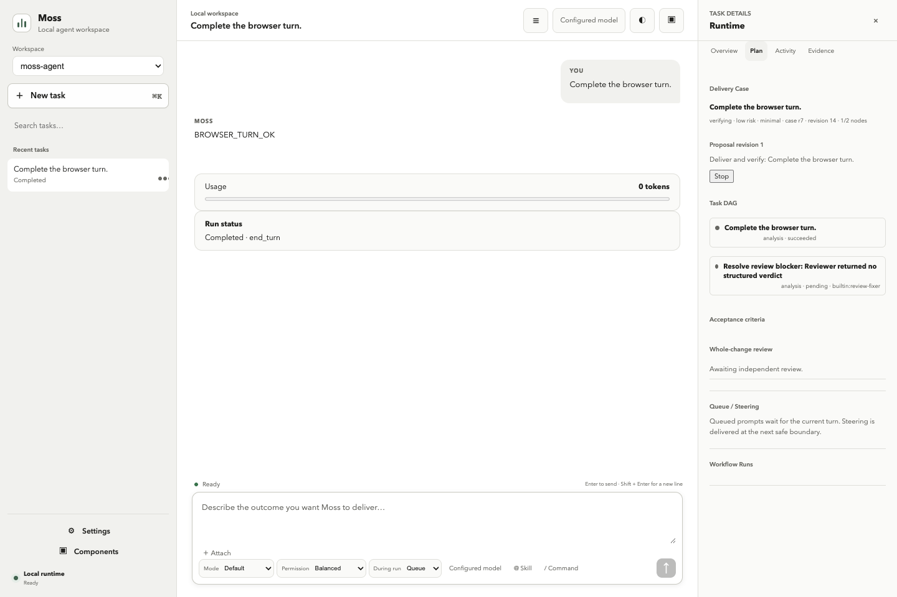

<div align="center">


# Moss

**A controllable terminal agent and embeddable TypeScript harness for coding, research, automation, and robotics.**

Built by [D-Robotics (地瓜机器人)](https://developer.d-robotics.cc)

[](https://github.com/D-Robotics/moss/actions/workflows/ci.yml)
[](https://www.npmjs.com/package/@rdk-moss/agent)
[](https://www.npmjs.com/package/@rdk-moss/core)
[](https://nodejs.org)
[](./LICENSE)

**English** · [简体中文](./README_CN.md)

</div>

Moss works inside a repository like a coding agent, researches current information through multiple
web paths, and connects to robot development boards over persistent SSH. You can use the terminal
product directly, embed the same runtime in a TypeScript host, or expose it to an IDE over ACP.

<p align="center">
  
</p>

## Quick start

Requires **Node.js ≥ 22.16.0**. The published CLI includes a ready-to-use D-Robotics model, so the
first run does not require a personal API key.

```bash
npm install -g @rdk-moss/agent@latest
cd your-project
moss
```

Useful first commands:

```bash
moss
moss "review the current diff"
moss resume --last
moss doctor
moss --help --all
```

Prefer a browser workspace after setup? Run `moss web` and open the displayed loopback URL.

Moss streams what it is doing, asks before sensitive actions under the default policy, and keeps the
active task steerable instead of disappearing into an opaque background run.

## What you can do

| Goal                               | Start with                                                   | Go deeper                                                                                                                       |
| ---------------------------------- | ------------------------------------------------------------ | ------------------------------------------------------------------------------------------------------------------------------- |
| **Change, test, or review code**   | `moss` or a one-shot prompt                                  | [Getting started](./docs/user-guide/01-getting-started.md)                                                                      |
| **Research with multiple sources** | Describe the question and required evidence                  | [Tools and commands](./docs/user-guide/04-slash-commands.md)                                                                    |
| **Run long, resumable work**       | `/goal`, `/loop`, `/tasks`, `moss resume --last`             | [Long-horizon tasks](./docs/user-guide/25-long-horizon-tasks.md)                                                                |
| **Orchestrate specialist agents**  | Route advisor, implementer, and verifier roles by capability | [Long-horizon tasks](./docs/user-guide/25-long-horizon-tasks.md) and [custom experts](./docs/user-guide/22-subagent-experts.md) |
| **Work with robot boards**         | Connect a device, then use device and ROS skills/tools       | [Skills](./docs/user-guide/08-skills.md)                                                                                        |
| **Add external capabilities**      | Skills, tools, MCP, providers, hooks, or platform extensions | [Extending Moss](./packages/moss-agent/EXTENDING.md)                                                                            |
| **Embed an agent in your product** | `MossAgent` or the ACP stdio server                          | [Runtime API](./packages/moss-agent/API.md)                                                                                     |
| **Use a browser workspace**        | `moss web`                                                   | [Web workspace](./docs/user-guide/24-web-ui.md)                                                                                 |

Current behavior comes from CLI help, public exports, manifests, and tests. This README intentionally
does not maintain a feature count, test count, or roadmap snapshot.

## Choose a runtime

| Mode                    | Command                                                                       | Best for                                                                       |
| ----------------------- | ----------------------------------------------------------------------------- | ------------------------------------------------------------------------------ |
| **Interactive TUI**     | `moss`                                                                        | Daily coding and research with streaming output, approvals, and slash commands |
| **One-shot / piped**    | `moss "prompt"` · `echo … \| moss` · `--json` / `--output-format stream-json` | Scripts, CI, and pipelines                                                     |
| **ACP stdio server**    | `moss agent stdio`                                                            | IDE or editor integration over a host-neutral JSON-RPC protocol                |
| **Local Web workspace** | `moss web`                                                                    | Browser chat, cancellation, capability inspection, and durable run evidence    |
| **Embedded runtime**    | `@rdk-moss/agent`                                                             | Products that own their UI, identity, storage, and approval experience         |

All paths share the same runtime contracts rather than reimplementing the agent loop per host. The
Web workspace binds to loopback by default and keeps model credentials in the host process.

## Long-horizon execution

Moss records durable work as an Execution Graph shared by the CLI, TUI, Web workspace, and ACP. The
graph keeps the objective, dependencies, role assignments, visible budgets, workspace leases,
evidence, and verification verdict in one recoverable state. After a process restart, recovered work
is paused for review; interrupted external mutations are blocked instead of being replayed silently.

Use `/tasks` to list graphs and `/task inspect <task-id>` to review their nodes and evidence. Continue
with `/task resume <task-id>`, retry an eligible node with `/task retry <task-id> <node-id>`, or cancel
with `/task stop <task-id>`.

Dependency-ready nodes can run concurrently. Implementers write only in isolated workspaces and
return guarded patches; separate verifiers produce fresh machine evidence after merge. Missing
evidence, an unmerged patch, a running background node, or failed verification prevents Moss from
claiming completion. See [Long-horizon tasks](./docs/user-guide/25-long-horizon-tasks.md) for the full
recovery and completion contract.

For user-visible or higher-risk changes, the same graph also carries a Delivery Case:
`intake → elaborating → proposed → executing → verifying → completed`. Risk sets a minimum delivery
depth, mutating nodes require revisioned acceptance criteria, and changing those criteria makes old
verification stale. Standard and comprehensive work must pass an independent read-only whole-change
review before Moss can produce an evidence-linked Completion Report. The Web details rail shows this
case, its task DAG, criteria, review rounds, evidence, limitations, and follow-ups without creating a
second project-management database.



## Safety and control

The default `balanced` profile supports normal development while asking before sensitive actions.
`readonly` and `autonomous` define the conservative and explicit high-autonomy bounds.

- User safety settings override project settings; a cloned repository cannot silently lower them.
- Tool metadata, runtime policy, hooks, schema validation, and host approval all participate in a
  state-changing action.
- Active work can be steered, queued, inspected, stopped, and resumed.
- `moss setup` stores its key encrypted in user configuration by default. Explicit project
  configuration can also provide model credentials, so never commit secrets.
- Tool or provider success must come from the real result, not a fixed optimistic message.

```bash
moss setup
moss config --help
moss doctor
```

Read [Configuration](./docs/user-guide/05-configuration.md), [Sandbox and permissions](./docs/user-guide/18-sandbox.md),
and [Security](./packages/moss-agent/SECURITY.md) before changing trust boundaries.

## Extend Moss

| Extension surface                      | Use it for                                                                   |
| -------------------------------------- | ---------------------------------------------------------------------------- |
| **Persona and prompt layers**          | Product identity and stable behavioral context                               |
| **Skills and capability packs**        | On-demand workflows and domain knowledge                                     |
| **Tools and hooks**                    | Typed actions, validation, approvals, observation, and result handling       |
| **MCP servers**                        | External tools and resources through a standard protocol                     |
| **Providers**                          | Model backends with explicit capabilities and normalized errors              |
| **Knowledge and memory**               | Searchable domain context and scoped long-term state                         |
| **Agent roles and expert teams**       | Capability-routed advisors, isolated implementers, and independent verifiers |
| **Platform extensions / Host Adapter** | Host-owned identity, UI, persistence, devices, and policy integration        |

Choose one owner for each capability; do not register parallel tools that answer the same intent. The
selection guide and implementation contracts live in
[`EXTENDING.md`](./packages/moss-agent/EXTENDING.md).

## Embed the runtime

```bash
npm install @rdk-moss/agent @rdk-moss/core
npx create-moss-app my-agent
```

```ts
import {
  InMemorySessionStore,
  MossAgent,
  OpenAILLMProvider,
  registerBuiltinTools,
} from '@rdk-moss/agent';

const agent = new MossAgent({
  llmProvider: new OpenAILLMProvider({
    apiKey: process.env.MY_MODEL_API_KEY!,
    baseUrl: 'https://provider.example/v1',
    defaultModel: 'model-name',
  }),
  sessionStore: new InMemorySessionStore(),
  model: 'model-name',
  workspaceDir: process.cwd(),
  hooks: {
    onBeforeToolExec: async ({ tool }) =>
      tool.metadata?.sideEffectClass === 'readonly'
        ? { approved: true }
        : { approved: false, reason: 'Host approval required' },
  },
});
registerBuiltinTools(agent);

for await (const event of agent.streamChat('session-1', 'Check project health')) {
  if (event.type === 'text_delta') process.stdout.write(event.delta);
}
await agent.close();
```

Production hosts should provide their own approval hook, persistent session store, identity, and
secret handling. See the [package README](./packages/moss-agent/README.md),
[public API](./packages/moss-agent/API.md), and [Host Adapter contract](./docs/host-adapter-contract.md).

## Architecture

```text
TUI / one-shot / ACP / host application
                  │
                  ▼
        @rdk-moss/agent
  agent loop · context · tools · providers
  execution graph · evidence · workspace leases
  sessions · skills · memory · MCP · devices
                  │
                  ▼
         @rdk-moss/core
  provider-neutral contracts and prompt policy

create-moss-app ──scaffolds──▶ agent ──depends on──▶ core
```

Moss owns the host-neutral runtime and contracts. A host owns product UI, authentication, durable
storage, deployment, and any stricter approval policy. Robotics support composes through skills,
knowledge, tools, and adapters, so Moss remains useful without a connected device. The stable
ownership, execution, state, and failure boundaries are documented in
[`ARCHITECTURE.md`](./ARCHITECTURE.md).

## Documentation by role

| I want to…                             | Start here                                                                 |
| -------------------------------------- | -------------------------------------------------------------------------- |
| Use the CLI or TUI                     | [User guide](./docs/user-guide/README.md)                                  |
| Configure models, permissions, and MCP | [Configuration](./docs/user-guide/05-configuration.md)                     |
| Run or recover long-horizon tasks      | [Long-horizon tasks](./docs/user-guide/25-long-horizon-tasks.md)           |
| Understand runtime boundaries          | [Architecture](./ARCHITECTURE.md)                                          |
| Embed or extend the runtime            | [Extending Moss](./packages/moss-agent/EXTENDING.md)                       |
| Use the public runtime API             | [API reference](./packages/moss-agent/API.md)                              |
| Implement a host                       | [Host Adapter contract](./docs/host-adapter-contract.md)                   |
| Contribute code                        | [CONTRIBUTING.md](./CONTRIBUTING.md)                                       |
| Work as a coding agent                 | [AGENTS.md](./AGENTS.md)                                                   |
| Navigate all engineering documents     | [Documentation map](./docs/README.md)                                      |
| Reproduce agent evaluation evidence    | [Leaderboard and cloud/local evaluation](./docs/leaderboard-evaluation.md) |

Design notes explain intent. Source, tests, manifests, API reports, active OpenSpec, and released
changelog entries decide current behavior.

## Develop

```bash
git clone https://github.com/D-Robotics/moss.git
cd moss
npm ci
npm run check
npm run verify
npm run smoke:moss-cli
```

`npm run check` is the canonical fast gate. `npm run verify` adds the benchmark, build, API checks,
and all package tests. Contribution and release rules live in
[`CONTRIBUTING.md`](./CONTRIBUTING.md); repository instructions live in [`AGENTS.md`](./AGENTS.md).

## License

[MIT](./LICENSE)
