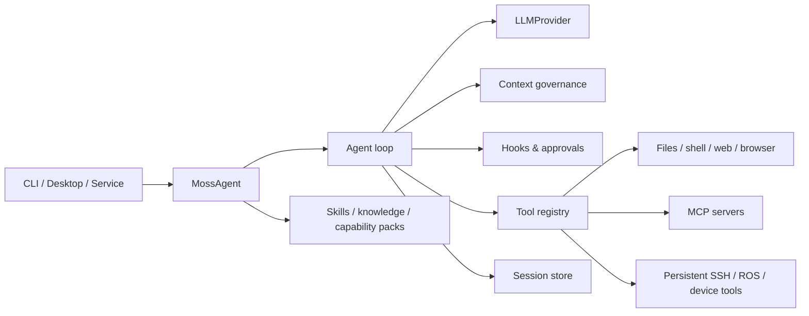

<div align="center">


# Moss

**A cross-platform agent harness for coding, automation, and robotics.**

Built by [D-Robotics (地瓜机器人)](https://developer.d-robotics.cc)

[](https://github.com/D-Robotics/moss/actions/workflows/ci.yml)
[](https://www.npmjs.com/package/@rdk-moss/agent)
[](https://www.npmjs.com/package/@rdk-moss/core)
[](https://nodejs.org)
[](./LICENSE)

**English** · [简体中文](./README_CN.md)

</div>

Moss is both a terminal agent and an embeddable TypeScript runtime. It can inspect a repository, edit files, run commands, search the web, use MCP tools, preserve sessions, and work through long-running goals. Robotics support is layered on top through skills and a persistent SSH board connection, rather than hard-coded into the core agent loop.

<p align="center">
  
</p>

## Why Moss

- **Useful from the terminal** — interactive TUI, one-shot mode, saved sessions, file attachments, diff review, and health diagnostics.
- **Controllable while it works** — queue another prompt, use `/steer` to change the active task, or ask an isolated `/btw` side question.
- **Built for long tasks** — context pruning and compaction, resumable sessions, `/goal`, and an autonomous `/loop` mode.
- **Safe by default** — the balanced profile allows workspace writes but still prompts before sensitive actions; read-only and autonomous profiles are available explicitly.
- **Provider and tool neutral** — use the bundled model path, configure another provider, register custom tools, or attach MCP servers.
- **Robot-ready without narrowing the core** — `/connect` establishes a persistent SSH session and enables board, camera, ROS 1, and ROS 2 workflows based on discovered capabilities.

## Install

Moss requires **Node.js 22.16 or newer**.

```bash
npm install -g @rdk-moss/agent@latest
moss
```

The published CLI includes a bundled D-Robotics model configuration, so a first run can start without adding a personal API key. Service availability and usage policy depend on the current hosted service. To use your own provider or endpoint:

```bash
moss setup
```

Moss stores configuration outside the repository and can also read project-specific settings from `.moss/config.json`. Run `moss doctor` or `/status --verbose` whenever you want to see which configuration is active.

## Quick Start

Start an interactive session in a project:

```bash
cd your-project
moss
```

Then describe the outcome you want:

```text
Inspect this repository, find why the login test is flaky, fix the root cause,
and run the narrowest useful verification before summarizing the change.
```

Useful shell entry points:

```bash
moss "review the current diff for correctness"   # one-shot task
moss --session release                            # named persistent session
moss resume --last                                # resume the latest session
moss doctor                                       # config, network, board, and MCP checks
moss setup                                        # provider/model configuration
```

## Work With The Agent

Type `/help` in the TUI for the complete command list. These commands cover the main workflows:

| Command | Purpose |
|---|---|
| `/status` | Show the active model, workspace, device, and tool state. |
| `/model` | Select or switch the model for the current session. |
| `/sessions` · `/resume` | List and restore saved conversations. |
| `/steer <constraint>` | Change the active task at the next safe model or tool boundary. |
| `/btw <question>` | Ask a concurrent side question without polluting the main task context. |
| `/queue pause` · `/queue resume` | Control prompts waiting behind the active task. |
| `/goal <objective>` | Persist a larger objective and continue working toward it across runs. |
| `/loop <goal>` | Run autonomous iterations until Moss judges the goal complete or you stop it. |
| `/compact [instructions]` | Summarize older context while preserving the current task and tool round-trips. |
| `/review` | Review the working-tree diff for bugs, security issues, and unnecessary complexity. |
| `/diff` · `/rewind` | Inspect changes or restore a file-edit checkpoint. |
| `/permissions` | Inspect or change the session safety and approval policy. |
| `/soul` | Show, initialize, or switch the active `soul.md` persona. |
| `/mcp` · `/doctor` | Inspect connected MCP servers and diagnose the runtime. |

During a run:

- Press **Enter** with another prompt to queue it.
- Use `/steer` when the new message should alter the current task instead of becoming a separate task.
- Use `/btw` for a quick contextual question while the main task keeps running.
- Use `/stop` to request cancellation; tool and process cleanup is tracked before the run is finalized.
- Mention a file with `@path` or paste a file path to attach source or image context.

## Connect A Robot

Connect by address or SSH-style target:

```text
/connect 192.168.1.10
/connect root@192.168.1.10
/connect 192.168.1.10 --user root --key ~/.ssh/id_ed25519
```

Moss keeps one SSH control connection for the session and routes subsequent board operations through it. After connection, it discovers available capabilities before choosing device, camera, ROS 1, or ROS 2 tools; it does not assume every board uses the same camera bus or ROS distribution.

Credential defaults can be provided with `MOSS_DEVICE_USER`, `MOSS_DEVICE_PASSWORD`, `MOSS_DEVICE_KEY`, and `MOSS_DEVICE_PORT`. Use `/disconnect` to close board mode and return to local tools.

## Personas, Skills, And Tools

Moss separates identity from capability:

- **Persona** — project persona at `.moss/soul.md`, global persona at the Moss config directory, or a selectable SkillHub Soul through `/soul`.
- **Project instructions** — `AGENTS.md` gives repository-specific working rules.
- **Skills** — `SKILL.md` packages provide reusable domain workflows and can be enabled or disabled per session.
- **Tools** — built-in tools, programmatic `agent.tools.register(...)` tools, file-based tools, and MCP tools share the same execution and approval boundary.

Start a project persona without overwriting an existing file:

```text
/soul init
```

See [`docs/soul-md-design.md`](./docs/soul-md-design.md) and [`packages/moss-agent/EXTENDING.md`](./packages/moss-agent/EXTENDING.md) for the identity and extension contracts.

## Embed Moss

Install the runtime packages:

```bash
npm install @rdk-moss/agent @rdk-moss/core
```

Provide an `LLMProvider`, a session store, and any host policy you need:

```ts
import {
  InMemorySessionStore,
  MossAgent,
  OpenAILLMProvider,
  registerBuiltinTools,
} from '@rdk-moss/agent';

const model = 'your-model';
const provider = new OpenAILLMProvider({
  apiKey: process.env.MY_MODEL_API_KEY!,
  baseUrl: 'https://your-provider.example/v1',
  defaultModel: model,
});

const agent = new MossAgent({
  llmProvider: provider,
  sessionStore: new InMemorySessionStore(),
  model,
  workspaceDir: process.cwd(),
  hooks: {
    onBeforeToolExec: async (request) => {
      return request.tool.metadata?.sideEffectClass === 'readonly'
        ? { approved: true }
        : { approved: false, reason: 'Host approval required' };
    },
  },
});

registerBuiltinTools(agent);

agent.tools.register({
  name: 'project_health',
  description: 'Return application health information',
  inputSchema: { type: 'object', properties: {} },
  execute: async () => JSON.stringify({ status: 'ok' }),
});

for await (const event of agent.streamChat('session-1', 'Check project health')) {
  if (event.type === 'text_delta') process.stdout.write(event.delta);
}

agent.dispose();
```

The public runtime includes:

- `MossAgent`, session stores, tool registry, and provider contracts.
- Context budgeting, pruning, compaction, prompt-cache telemetry, and token usage helpers.
- Guardrails, approvals, tool hooks, structured output, steering, and async task contracts.
- Device SSH, diagnostics, ROS 1/ROS 2 helpers, browser tools, and capability packs.
- Host Adapter, Knowledge Module, Platform Extension, and Vendor Plugin contracts from `@rdk-moss/core`.

Read [`packages/moss-agent/API.md`](./packages/moss-agent/API.md), [`packages/moss-agent/EXTENDING.md`](./packages/moss-agent/EXTENDING.md), and [`docs/host-adapter-contract.md`](./docs/host-adapter-contract.md) before building a host integration.

## Safety And Configuration

Moss has three configuration profiles:

| Profile | Filesystem policy | Approval policy | Intended use |
|---|---|---|---|
| `cautious` | Read-only | Prompt | Inspection and unfamiliar repositories. |
| `balanced` | Workspace writes | Prompt | Default interactive development. |
| `autonomous` | Workspace writes | Never ask | Explicitly trusted automation environments. |

Change the active profile through setup/configuration or inspect the resolved policy with `/permissions`. Project configuration that declares its own provider or endpoint does not inherit a user-level API key, preventing a repository-controlled endpoint from receiving an unrelated personal credential.

For environment variables and operational settings, see [`docs/env-vars.md`](./docs/env-vars.md).

## Architecture



The repository is split into:

- [`packages/moss-agent`](./packages/moss-agent) — terminal CLI and embeddable agent runtime.
- [`packages/moss`](./packages/moss) — host-neutral contracts, knowledge interfaces, platform extensions, and prompts.
- [`packages/create-moss-app`](./packages/create-moss-app) — project scaffolding CLI.
- [`benchmarks`](./benchmarks) — the 200-scenario harness coverage catalog and recorded efficiency runs.

## Develop

```bash
git clone https://github.com/D-Robotics/moss.git
cd moss
npm ci
npm run verify
npm run smoke:moss-cli
```

`npm run verify` runs boundary and workspace-hygiene checks, validates the harness benchmark data, builds every workspace, type-checks, lints, and runs the complete test suite. `npm run smoke:moss-cli` packs the current workspaces, installs them into a temporary project, and verifies the installed command plus interactive PTY startup.

CI runs `npm run verify` on **Ubuntu, macOS, and Windows** with Node.js **22.16.0**.

Before contributing, read [`CONTRIBUTING.md`](./CONTRIBUTING.md). Package-specific security policies live alongside each published package.

## License

[MIT](./LICENSE)
