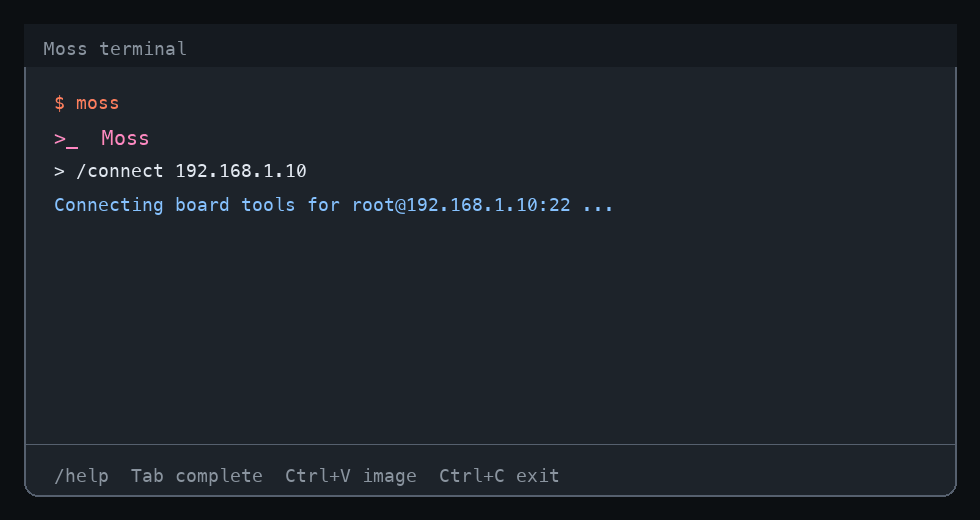

<div align="center">


# Moss

**A practical agent harness for coding, research, automation, and robotics.**

Built by [D-Robotics (地瓜机器人)](https://developer.d-robotics.cc)

[](https://github.com/D-Robotics/moss/actions/workflows/ci.yml)
[](https://www.npmjs.com/package/@rdk-moss/agent)
[](https://www.npmjs.com/package/@rdk-moss/core)
[](https://nodejs.org)
[](./LICENSE)

**English** · [简体中文](./README_CN.md)

</div>

Moss is a cross-platform terminal agent and an embeddable TypeScript runtime. It can inspect and modify repositories, run commands, research current information, use MCP and custom tools, preserve long-running work, and connect to robot development boards through a persistent SSH session.

<p align="center">
  
</p>

## Start In 30 Seconds

Moss requires **Node.js 22.16 or newer**.

```bash
npm install -g @rdk-moss/agent@latest
cd your-project
moss
```

The published CLI includes a ready-to-use D-Robotics model configuration. A personal model API key is not required for the first run. To use another provider or endpoint, run:

```bash
moss setup
```

Then ask for an outcome, not a sequence of button clicks:

```text
Find why the login integration test is flaky, fix the root cause,
run the narrowest useful verification, and summarize the evidence.
```

Common entry points:

```bash
moss                                      # interactive TUI
moss "review the current diff"            # one-shot task
moss --session release                    # named persistent session
moss resume --last                        # resume the latest session
moss doctor                               # diagnose config, network, MCP, and device state
moss --help --all                         # complete CLI reference
```

## What Makes Moss Useful

- **Interactive without losing control** — steer the active run, queue follow-up work, ask an isolated side question, inspect details, or stop safely.
- **Designed for long tasks** — persistent goals, resumable sessions, context pruning, compaction, tool-round-trip repair, and an optional autonomous loop.
- **Safe by default** — the default `balanced` profile permits normal workspace work but asks before sensitive actions; broader access must be selected explicitly.
- **Research beyond one search result** — web search, page fetching, RSS discovery, browser reading, and parallel source gathering can be combined when available.
- **Identity is configurable** — use a project or global `soul.md`, or select a SkillHub Soul from inside the TUI.
- **Robot development is first-class, not hard-coded** — board, camera, ROS 1, and ROS 2 workflows are enabled from discovered device capabilities.
- **Embeddable by humans and agents** — the same runtime exposes streaming events, tools, approvals, usage accounting, session stores, and extension contracts.

<p align="center">
  
</p>

## Control A Running Task

Type `/help` in the TUI for the complete command list.

| Command | Purpose |
|---|---|
| `/status` | Show the active model, workspace, permissions, device, and tools. |
| `/steer <instruction>` | Change the active task at the next safe boundary. |
| `/btw <question>` | Ask a side question without adding it to the main task context. |
| `/queue pause` · `/queue resume` | Control prompts waiting behind the active run. |
| `/goal <objective>` | Persist an objective across compaction, restart, and resume. |
| `/loop <objective>` | Continue autonomous iterations until completion or `/stop`. |
| `/compact [instructions]` | Compact older history while preserving active work. |
| `/cost` | Show recorded token and cost data from the configured usage log. |
| `/review` | Review the working tree for correctness, security, and unnecessary complexity. |
| `/diff` · `/rewind` | Inspect edits or restore a file-edit checkpoint. |
| `/permissions` | Inspect or change the active approval profile. |
| `/soul` | View and switch the active persona. |
| `/connect <target>` | Open a persistent SSH board session. |
| `/doctor` · `/mcp` | Diagnose the runtime or inspect MCP servers. |

While Moss is working:

- Submit another prompt to queue it.
- Use `/steer` when the new instruction should alter the current run.
- Use `/btw` for a concurrent question whose answer should not pollute the main context.
- Use `/stop` to cancel the run and its active tool work.
- Press `Ctrl+O` to expand execution details.
- Press `Ctrl+V`, paste a Finder file, or paste a local path to attach source or images.

## Soul, Instructions, And Skills

Moss separates **who the agent is** from **what the agent can do**:

| Layer | Location | Responsibility |
|---|---|---|
| Soul | `.moss/soul.md` or global `soul.md` | Persona, voice, values, and collaboration style. |
| Project instructions | `AGENTS.md` | Repository rules, commands, constraints, and verification expectations. |
| Skills | `SKILL.md` packages | Reusable workflows and domain expertise. |
| Tools | Built-ins, custom tools, MCP | Observable actions with approval and execution contracts. |

Useful Soul commands:

```text
/soul                 # inspect or choose in the TUI
/soul init            # create .moss/soul.md without overwriting an existing file
/soul list            # list bundled/available choices
/soul use <CODE>      # install and activate a SkillHub Soul
/soul default         # restore the built-in Moss persona for this workspace
```

When a selected Soul requires SkillHub, Moss can bootstrap the official CLI and continue the installation flow. Persona content remains owned by its original authors. See [`docs/soul-md-design.md`](./docs/soul-md-design.md) for discovery and precedence rules.

## Research And Current Information

Moss does not treat a single search result as sufficient evidence for an important answer. Its research path can combine:

1. multiple queries and languages;
2. web search and direct page fetching;
3. RSS or feed discovery for time-sensitive sources;
4. browser reading when a site blocks ordinary fetching;
5. parallel source collection followed by date and claim verification.

Search providers can fail, block automation, or return stale results. Moss should report that limitation instead of inventing confidence. For current news, laws, prices, releases, or product facts, ask it to include source dates and distinguish verified facts from unconfirmed leads.

## Connect A Robot

```text
/connect 192.168.1.10
/connect root@192.168.1.10
/connect 192.168.1.10 --user root --key ~/.ssh/id_ed25519
```

`/connect` verifies SSH before declaring success, keeps a control connection for the session, and routes later device operations through that connection. Moss discovers the board before choosing tools; it does not assume every camera is USB or every robot uses the same ROS distribution.

Typical connected workflows include:

- board health, processes, storage, networking, and logs;
- USB and MIPI camera discovery and capture diagnostics;
- ROS 1 and ROS 2 node, topic, service, and launch inspection;
- remote build, deployment, model execution, and performance investigation;
- board-local web interfaces through the verified device target.

<p align="center">
  
</p>

Environment defaults are available through `MOSS_DEVICE_USER`, `MOSS_DEVICE_PASSWORD`, `MOSS_DEVICE_KEY`, and `MOSS_DEVICE_PORT`. Use `/disconnect` to close board mode and return to local tools.

## Embed Moss

```bash
npm install @rdk-moss/agent @rdk-moss/core
```

```ts
import {
  InMemorySessionStore,
  MossAgent,
  OpenAILLMProvider,
  registerBuiltinTools,
} from '@rdk-moss/agent';

const model = 'your-model';
const agent = new MossAgent({
  llmProvider: new OpenAILLMProvider({
    apiKey: process.env.MY_MODEL_API_KEY!,
    baseUrl: 'https://your-provider.example/v1',
    defaultModel: model,
  }),
  sessionStore: new InMemorySessionStore(),
  model,
  workspaceDir: process.cwd(),
  recordLlmUsage: true,
  hooks: {
    onBeforeToolExec: async ({ tool }) =>
      tool.metadata?.sideEffectClass === 'readonly'
        ? { approved: true }
        : { approved: false, reason: 'Host approval required' },
  },
});

registerBuiltinTools(agent);

agent.tools.register({
  name: 'project_health',
  description: 'Return application health information',
  inputSchema: { type: 'object', properties: {} },
  execute: async () => JSON.stringify({ status: 'ok' }),
});

for await (const event of agent.streamChat('session-1', 'Check project health')) {
  if (event.type === 'text_delta') process.stdout.write(event.delta);
  if (event.type === 'llm_usage') console.error(event);
}

agent.dispose();
```

The public runtime includes:

- provider and session-store contracts;
- streaming agent events and final `ChatResult` usage;
- built-in and custom tool registration;
- approvals, hooks, guardrails, structured output, and steering;
- context budgeting, pruning, compaction, and prompt-cache telemetry;
- knowledge, memory, skills, capability packs, MCP, and platform extensions;
- device SSH, robotics helpers, browser tools, and diagnostics.

Compaction calls are accounted in the same usage stream as normal turns. A custom `llmUsageLogPath` or `MOSS_LLM_USAGE_LOG` is respected by both recording and `/cost` reporting. Injected registries remain owned by the host; resources created internally by an Agent are cleaned up by `dispose()`.

See [`packages/moss-agent/API.md`](./packages/moss-agent/API.md), [`packages/moss-agent/EXTENDING.md`](./packages/moss-agent/EXTENDING.md), and the generated package exports for the full contract.

## Permissions And Configuration

The default profile is **balanced**, not unrestricted.

| Profile | Intent |
|---|---|
| `readonly` | Inspect and explain without modifying the workspace. |
| `balanced` | Normal development work with approval for sensitive actions. |
| `autonomous` | Broad execution for an explicitly trusted environment. |

Configuration priority is:

1. CLI flags and `-c` overrides;
2. project `.moss/config.json`;
3. user configuration;
4. bundled defaults.

```bash
moss setup
moss config --help
moss doctor
```

Secrets are collected through hidden prompts where possible. Model settings are intentionally not inferred from unrelated provider environment variables. Keep autonomous mode for disposable or otherwise trusted environments.

## Reliability Contracts

Moss treats harness behavior as a contract, not a UI illusion. Current regression coverage includes:

- active goals surviving automatic compaction, process restart, and resume;
- tool-use/tool-result pairing through pruning and overflow recovery;
- per-call and cumulative token usage, including cache and compaction usage;
- custom usage-log paths matching CLI `/cost` output;
- instance-scoped state and ownership of injected resources;
- abort, timeout, process cleanup, queueing, steering, BTW, and connection behavior;
- packaged CLI smoke tests on the supported operating systems.

This does not mean every model, website, board, or MCP server behaves perfectly. It means failures should be observable, attributable, and covered by the narrowest reproducible contract when fixed.

## Architecture

```text
packages/moss/          provider-neutral contracts and prompt policy
packages/moss-agent/    runtime, loop, context, tools, TUI, CLI, robotics
packages/moss-cli/      CLI packaging/integration surface
docs/                   design notes, architecture, benchmarks, and guides
scripts/                verification, release, benchmark, and smoke tooling
```

Moss keeps the core agent loop provider-neutral. Coding, research, robotics, and host-specific behavior are added through tools, prompt layers, capability packs, skills, knowledge modules, and adapters rather than a single monolithic mode.

<p align="center">
  
</p>

## Develop

```bash
git clone https://github.com/D-Robotics/moss.git
cd moss
npm install
npm run build
npm run verify
npm run smoke:moss-cli
```

Useful checks:

```bash
npm test
npm run lint
npm run typecheck
npm run check:agent-harness-benchmark
```

Requirements and contribution guidance live in [`CONTRIBUTING.md`](./CONTRIBUTING.md). Security issues should follow [`packages/moss-agent/SECURITY.md`](./packages/moss-agent/SECURITY.md).

## License

[MIT](./LICENSE)
