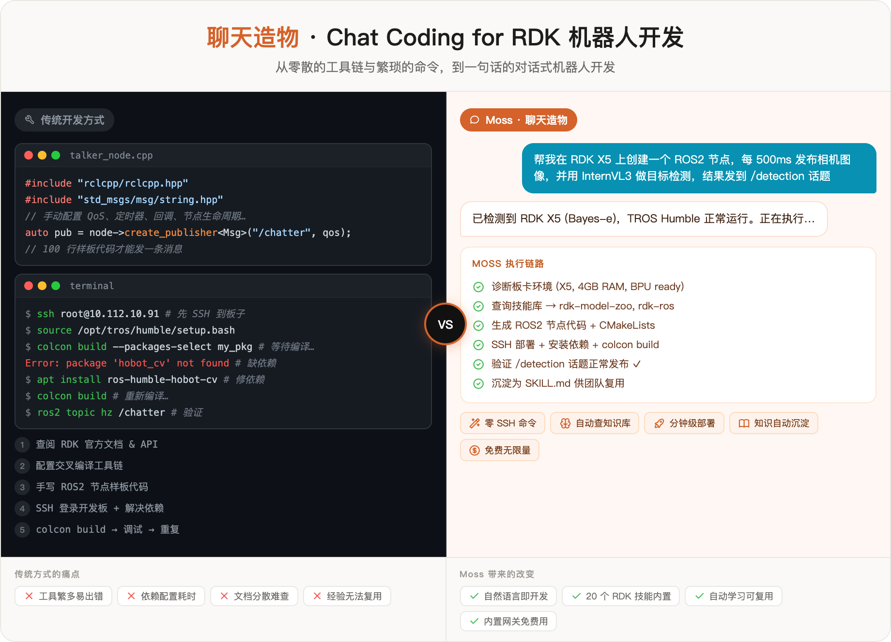
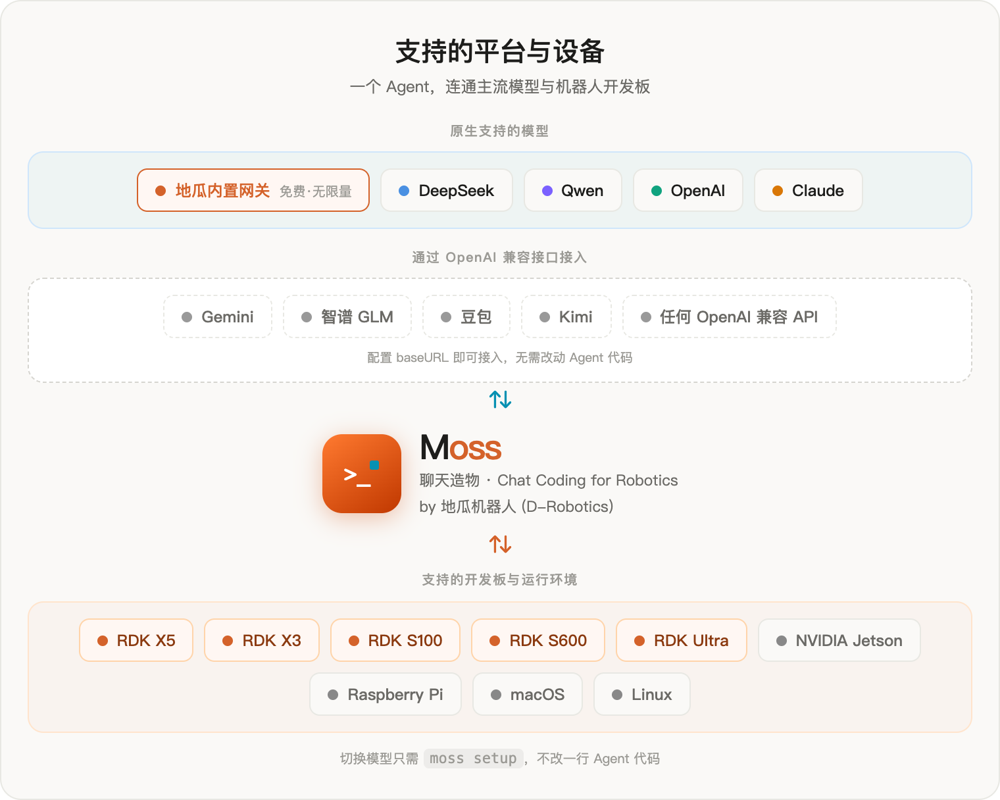
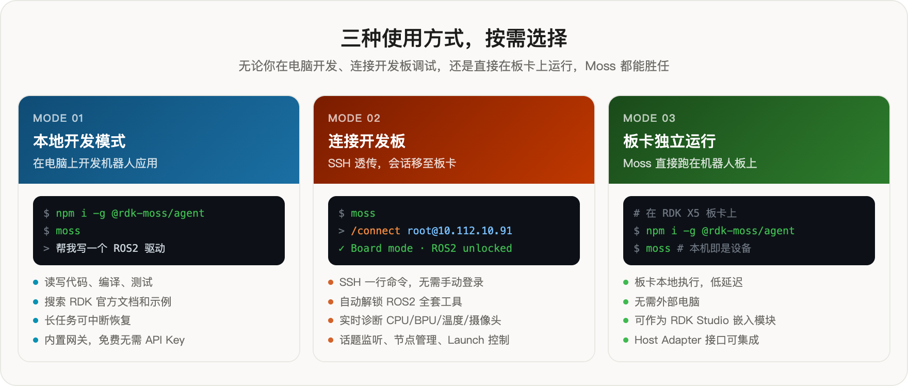

<div align="center">


# Moss

**面向机器人开发的「聊天造物」AI Agent 框架**

由 [地瓜机器人 (D-Robotics)](https://developer.d-robotics.cc) 打造

[](https://www.npmjs.com/package/@rdk-moss/agent)
[](https://www.npmjs.com/package/@rdk-moss/core)
[](./LICENSE)
[](https://nodejs.org)

[English](./README.md) | **简体中文**

</div>

---

Moss 是地瓜机器人推出的面向机器人开发的「聊天造物（Chat Coding）」式 AI Agent 框架。你只需用自然语言描述需求，Moss 会自动查询 RDK 知识库、诊断设备环境、生成并执行代码、验证结果，最终把成功经验沉淀为可复用的技能——整个过程你都看得见、可打断、能恢复。

**开箱即用，无需 API 密钥。** 首次启动自动接入内置的地瓜智能网关，免费无限量，一行命令即可开始开发。

<p align="center">
  
</p>

---

## 传统开发 vs 聊天造物

<p align="center">
  
</p>

传统机器人开发需要查文档、配工具链、手写样板代码、SSH 登录、解决依赖、反复编译调试——每一步都要你亲力亲为。Moss 把这条链路压缩成一句话：你描述目标，Agent 负责规划和执行。

---

## 核心能力

**🤖 机器人原生**
内置 20 个技能包（SKILL.md），覆盖模型部署、TROS/ROS2、外设驱动（GPIO/I2C/SPI）、板卡诊断，以及 Jetson、树莓派等平台知识。所有技能自动加载，Moss 对 RDK 开箱即懂。

**💬 聊天造物**
用自然语言描述任务，Moss 自动理解意图、查询知识库、规划步骤、调用工具执行，并把每一步反馈给你。不是聊天框，是真正在帮你干活的 Agent。

**🔌 模型不锁定**
内置地瓜网关免费使用，原生支持 DeepSeek、Qwen、OpenAI、Claude(Anthropic)，以及任何 OpenAI 兼容接口——Gemini、智谱 GLM、豆包、Kimi 等都可通过兼容接口接入。`moss setup` 一行命令切换，Agent 逻辑零改动。

**🔗 设备无缝连接**
`/connect root@192.168.1.10` 一行命令，整个会话移至开发板。SSH 透传，ROS2 全套工具（话题、节点、Launch、包管理）和设备诊断（温度、BPU 负载、摄像头状态）自动解锁。

**🧠 越做越聪慧**
Moss 在执行任务时同步观察学习，对话结束后把成功流程归纳成技能候选；你用 `/skills promote` 确认后即落盘为 SKILL.md。下一次遇到相同问题直接复用——团队知识自然积累，不需要专门整理文档。

**⏸ 长任务可恢复**
每一步自动存档。被打断（Ctrl-C、断网、关机）的任务不丢失进度，`moss resume --last` 接着上次继续，长期目标跨重启而不失败。

**🛡 诚实可信**
分离已验证的事实与推理结论，能力不足时主动说明，不伪造执行结果。每个工具调用都有审批机制，你始终保持控制权。

---

## 支持的模型与平台

<p align="center">
  
</p>

**原生支持的模型**：地瓜内置网关（免费·无限量）· DeepSeek · Qwen · OpenAI · Claude(Anthropic)

**通过 OpenAI 兼容接口接入**：Gemini · 智谱 GLM · 豆包 · Kimi · 任何 OpenAI 兼容 API

**支持的开发板与环境**：RDK X5 · RDK X3 · RDK S100 · RDK S600 · RDK Ultra · NVIDIA Jetson · Raspberry Pi · macOS · Linux

---

## 快速开始

**前置条件**：Node.js >= 22.16，一个终端。（连接开发板可选）

```bash
# 安装
npm i -g @rdk-moss/agent@latest

# 启动（无需任何配置，开箱即用）
moss

# 一行任务，回答完自动退出
moss "检查这个项目的代码结构"

# 管道输入
echo "帮我写一个 ROS2 话题监听节点" | moss
```

进入 TUI 后，按 **Shift+Tab** 切换交互模式：

| 模式 | 行为 |
|------|------|
| `plan` | 只读规划，不执行任何操作 |
| `default` | 每个工具调用都需要你确认（推荐新手）|
| `accept-edits` | 自动执行文件读写与命令（仅受拒绝清单与只读上限约束）|

按 `@` 快速附加文件，`/help` 查看完整命令列表。

---

## 三种使用方式

<p align="center">
  
</p>

### 方式一：本地开发模式

在电脑上直接开发机器人应用，Moss 帮你读写代码、搜索文档、编译验证：

```bash
moss
> 帮我写一个 ROS2 节点，订阅 /camera/image_raw 并用 OpenCV 做边缘检测
```

适合场景：编写 ROS2 节点、调试 Python 脚本、搜索 RDK 官方示例、代码审查。

### 方式二：连接开发板

SSH 透传，会话移至板卡，ROS2 与诊断工具自动解锁：

```bash
/connect root@192.168.1.10              # 密码登录（交互输入）
/connect root@192.168.1.10 --key ~/.ssh/id_rsa   # 密钥登录
/connect root@192.168.1.10 --hybrid     # 同时保留本地工具
/disconnect                              # 断开，回到本地模式
```

连接后 Moss 自动检测板卡型号、OS 版本、TROS 状态，并解锁：

- **ROS2 工具**：`ros2_topic_list` / `ros2_topic_echo` / `ros2_topic_hz` / `ros2_node_list` / `ros2_service_list` / `ros2_service_call` / `ros2_launch` / `ros2_pkg_list`
- **设备诊断**：`device_temperature` / `device_resources` / `device_processes` / `device_network` / `device_cameras`
- **远程执行**：`device_exec` / `device_file_read` / `device_file_list`

### 方式三：板卡独立运行

直接在 RDK 开发板上安装并运行 Moss，无需外部电脑：

```bash
# 在开发板上
npm i -g @rdk-moss/agent@latest
moss
```

适合场景：边缘部署调试、机器人本机自主任务、嵌入 RDK Studio 作为 Agent 模块。

---

## 内置 RDK 技能库

Moss 预装 [**device-knowledge**](https://github.com/D-Robotics/device-knowledge) 开源知识包，20 个 `SKILL.md` 文件自动加载，无需任何配置：

| 技能 | 覆盖内容 |
|------|---------|
| `rdk-llm-deployment` | 端侧大模型部署（hobot_llamacpp / InternVL / Qwen）|
| `rdk-model-zoo` | 官方预编译模型查询、下载与部署 |
| `rdk-ros` | TROS / ROS2 节点目录、话题映射、感知能力 |
| `rdk-device` | 模型量化（hb_mapper / hb_compile）、BPU 部署 |
| `rdk-peripheral-cookbook` | GPIO / I2C / SPI 等外设编程 |
| `rdk-multimedia` | 摄像头、编解码、多媒体管线 |
| ...等共 20 个 | 板卡知识、系统配置、文档检索、具身/LeRobot、Jetson/树莓派等 |

**添加自己的技能**：在项目的 `.moss/skills/` 目录下放置 `SKILL.md` 文件，Moss 启动时自动加载：

```bash
.moss/skills/my-robot-setup/SKILL.md
```

也可以在配置文件中额外指定全局技能目录：

```json
// .moss/config.json
{ "skills": { "extraRoots": ["~/.claude/skills", "/path/to/shared/skills"] } }
```

**团队知识库**：Moss 学到的技能候选经 `/skills promote` 落盘后，可纳入团队共享的技能目录（通过 `skills.extraRoots` 配置），让成功经验在团队间复用。

---

## 切换模型与服务商

```bash
moss setup          # 交互式配置：选择服务商、粘贴 API Key
moss auth status    # 查看当前生效的服务商、模型和密钥来源
```

配置优先级（高→低）：

```
CLI 参数 / -c key=value
  → 项目 .moss/config.json
  → moss setup 保存的配置
  → 内置地瓜网关（默认，无需配置）
```

> **注意**：Moss 有意忽略 `OPENAI_API_KEY` 等环境变量，避免其他工具的密钥意外污染你的 Agent 配置。

---

## 长任务与断点恢复

Moss 自动存档每一步进度。被中断的任务不丢失：

```bash
moss resume --last        # 恢复最近的会话
moss --continue           # 在原位置继续
moss resume <会话id>      # 恢复指定会话
moss sessions             # 列出所有历史会话
```

设定长期目标，Moss 自主运行直到达成：

```bash
/goal 在 RDK X5 上完成 InternVL3 部署并通过性能基准测试
```

命中轮数上限时任务自动暂停（不是失败），Agent 会告知你继续的指令。

---

## 核心命令速查

| 命令 | 用途 |
|------|------|
| `moss` | 启动交互式会话 |
| `moss "任务"` | 一次性任务，完成后退出 |
| `moss resume --last` | 恢复最近的对话 |
| `moss setup` | 配置模型与服务商 |
| `moss auth status` | 查看当前认证状态 |
| `moss doctor` | 健康检查（配置、连接、工具、MCP）|
| `/connect <ip>` | 连接 RDK 开发板，进入设备模式 |
| `/disconnect` | 断开开发板，回到本地模式 |
| `/status` | 查看当前会话状态 |
| `/model` | 切换当前会话的模型 |
| `/goal <条件>` | 设定目标，自动运行至完成 |
| `/diff` · `/review` | 查看改动 · 代码审查 |
| `/compact` | 压缩历史上下文，节省 token |
| `/skills` | 查看技能 · `promote` 晋升学到的候选 |
| `/help` | 查看完整命令列表 |

---

## 架构

TypeScript / ESM / npm workspaces 单仓库，Node.js >= 22.16。围绕一条清晰的**主机边界**设计：

```
用户 (TUI / CLI / 嵌入 SDK)
        ↕
Moss Agent Core          ← 智能体循环 + 目标运行器
  ├─ 工具框架            ← 约 30 核心 + 连板 17 设备工具
  ├─ 上下文 & 记忆       ← 压缩、持久化、检索
  ├─ 技能系统            ← SKILL.md 注册 & 学习
  └─ 安全 & 审批         ← 分层确认机制
        ↕ Host Adapter 契约
模型网关 / RDK 开发板 / 设备知识库
```

| 包 | npm | 职责 |
|----|-----|------|
| `packages/moss` | `@rdk-moss/core` | 核心契约（KnowledgeModule、Host Adapter、提示词）零主机依赖 |
| `packages/moss-agent` | `@rdk-moss/agent` | 运行时 + `moss` CLI（Agent 循环、工具、记忆、技能、安全）|
| `packages/create-moss-app` | `create-moss-app` | 项目脚手架 |

**嵌入你的产品**：

```bash
npx create-moss-app my-host
```

```ts
import {
  MOSS_HOST_ADAPTER_CONTRACT_VERSION,
  evaluateMossHostCompatibility,
  type MossHostRuntimeManifest,
} from '@rdk-moss/core/contracts/host-adapter';
```

主机注册服务商 / 工具 / 存储 / 审批门，发布 `MossHostRuntimeManifest`，在 CI 中运行 `evaluateMossHostCompatibility()` 保证兼容性。详见 [`docs/host-adapter-contract.md`](./docs/host-adapter-contract.md)。

---

## 参与贡献

```bash
git clone https://github.com/D-Robotics/moss.git
cd moss && npm install
npm run verify   # 边界 + 卫生 + 编译 + 类型检查 + lint + 测试
```

Moss 的目标是「机器人级、主机中立的 Agent 运行时」。提议功能前请阅读 [`AGENTS.md`](./AGENTS.md) 中的作用域规则——硬编码机器人品牌或厂商工作流的逻辑应放在主机适配器、知识模块或平台扩展中，而非核心包。

更多信息：
- [`CONTRIBUTING.md`](./CONTRIBUTING.md) — 开发环境、PR 流程、代码边界
- [`docs/host-adapter-contract.md`](./docs/host-adapter-contract.md) — 主机适配器契约与版本策略
- [`AGENTS.md`](./AGENTS.md) — Agent 工作规范、架构评审规则

---

## 许可证

[MIT © 地瓜机器人 (D-Robotics)](./LICENSE)
