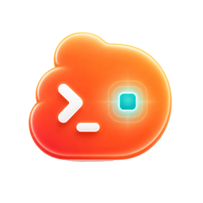
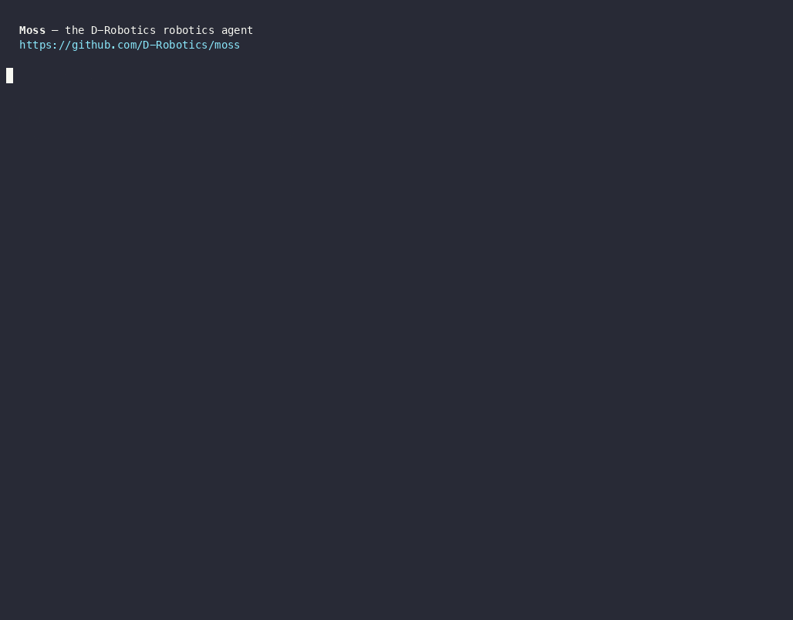

<div align="center">



# Moss

**可控的终端 Agent，也是可嵌入 TypeScript 产品的 Agent Harness，面向编程、研究、自动化与机器人。**

由 [地瓜机器人 (D-Robotics)](https://developer.d-robotics.cc) 打造

[](https://github.com/D-Robotics/moss/actions/workflows/ci.yml)
[](https://www.npmjs.com/package/@rdk-moss/agent)
[](https://www.npmjs.com/package/@rdk-moss/core)
[](https://nodejs.org)
[](./LICENSE)

[English](./README.md) · **简体中文**

</div>

Moss 可以像 coding agent 一样在仓库里工作，通过多条 Web 路径调研最新信息，并通过持久 SSH
连接机器人开发板。你既可以直接使用终端产品，也可以把同一套运行时嵌入 TypeScript 宿主，
或者通过 ACP 接入 IDE。

<p align="center">
  
</p>

## 快速开始

需要 **Node.js ≥ 22.16.0**。发布版 CLI 自带可用的地瓜模型，首次运行不需要个人 API Key。

```bash
npm install -g @rdk-moss/agent@latest
cd your-project
moss
```

建议先试这些命令：

```bash
moss
moss "review the current diff"
moss resume --last
moss doctor
moss --help --all
```

完成配置后如果更喜欢浏览器界面，可运行 `moss web` 并打开命令输出的本地地址。

Moss 会流式展示正在做什么，在默认策略下为敏感操作请求确认，并允许你随时调整任务，
而不是把工作藏进一个不可见的后台过程。

## 能做什么

| 目标                     | 从哪里开始                                      | 深入阅读                                                                                       |
| ------------------------ | ----------------------------------------------- | ---------------------------------------------------------------------------------------------- |
| **修改、测试或审查代码** | `moss` 或一行 prompt                            | [入门](./docs/user-guide/01-getting-started.md)                                                |
| **多来源调研**           | 描述问题与所需证据                              | [工具与命令](./docs/user-guide/04-slash-commands.md)                                           |
| **执行可恢复的长任务**   | `/goal`、`/loop`、`moss resume --last`          | [会话](./docs/user-guide/17-sessions.md)与[后台任务](./docs/user-guide/20-background-tasks.md) |
| **编排多 Agent 专家**    | 注册可信专家配置，再单独委派或并行 fan-out      | [自定义子 Agent 专家](./docs/user-guide/22-subagent-experts.md)                                |
| **连接机器人开发板**     | 连接设备，再使用设备与 ROS skills/tools         | [Skills](./docs/user-guide/08-skills.md)                                                       |
| **增加外部能力**         | Skills、tools、MCP、providers、hooks 或平台扩展 | [扩展 Moss](./packages/moss-agent/EXTENDING.md)                                                |
| **嵌入自己的产品**       | `MossAgent` 或 ACP stdio server                 | [运行时 API](./packages/moss-agent/API.md)                                                     |
| **使用浏览器工作区**     | `moss web`                                      | [Web 工作区](./docs/user-guide/24-web-ui.md)                                                   |

当前行为以 CLI help、公开 exports、manifest 和测试为准。README 不手工维护功能数量、
测试数量或路线图快照。

## 选择运行方式

| 方式                 | 命令                                                                          | 适合场景                                          |
| -------------------- | ----------------------------------------------------------------------------- | ------------------------------------------------- |
| **交互式 TUI**       | `moss`                                                                        | 日常 coding 与研究，带流式输出、审批和 slash 命令 |
| **一行 / 管道**      | `moss "prompt"` · `echo … \| moss` · `--json` / `--output-format stream-json` | 脚本、CI 与流水线                                 |
| **ACP stdio server** | `moss agent stdio`                                                            | IDE 或编辑器通过宿主中立的 JSON-RPC 协议接入      |
| **嵌入运行时**       | `@rdk-moss/agent`                                                             | 自己负责 UI、身份、存储和审批体验的产品           |

四种入口共享同一套 runtime contract，不需要每个宿主重新实现 Agent loop。

## 安全与控制

默认 `balanced` profile 支持日常开发，同时对敏感操作请求确认；`readonly` 与 `autonomous`
分别定义保守边界和需要显式开启的高自治边界。

- 用户安全配置优先于项目配置，克隆仓库不能静默降低安全级别。
- 工具 metadata、运行时策略、hooks、schema 校验和宿主审批共同约束有副作用操作。
- 运行中的任务可以调整、排队、查看详情、停止和恢复。
- `moss setup` 默认把密钥加密保存在用户配置中；显式项目配置也可以提供模型凭据，因此绝不能
  把密钥提交到仓库。
- 工具或 Provider 的成功必须来自真实结果，不能使用固定乐观文案。

```bash
moss setup
moss config --help
moss doctor
```

修改信任边界前先读[配置](./docs/user-guide/05-configuration.md)、
[Sandbox 与权限](./docs/user-guide/18-sandbox.md)和[安全说明](./packages/moss-agent/SECURITY.md)。

## 扩展 Moss

| 扩展面                         | 用于                                       |
| ------------------------------ | ------------------------------------------ |
| **Persona 与 prompt layers**   | 产品身份与稳定行为上下文                   |
| **Skills 与 capability packs** | 按需工作流和领域知识                       |
| **Tools 与 hooks**             | 类型化动作、校验、审批、观测和结果处理     |
| **MCP servers**                | 通过标准协议提供外部工具与资源             |
| **Providers**                  | 带显式能力和统一错误语义的模型后端         |
| **Knowledge 与 memory**        | 可检索领域上下文和分 scope 的长期状态      |
| **子 Agent 专家**              | 用于单独或并行委派的可复用、有边界专家配置 |
| **平台扩展 / Host Adapter**    | 宿主身份、UI、持久化、设备与策略集成       |

每项能力只选择一个 owner，不要注册回答同一意图的平行工具。选择指南和实现契约见
[`EXTENDING.md`](./packages/moss-agent/EXTENDING.md)。

## 嵌入运行时

```bash
npm install @rdk-moss/agent @rdk-moss/core
npx create-moss-app my-agent
```

```ts
import {
  InMemorySessionStore,
  MossAgent,
  OpenAILLMProvider,
  registerBuiltinTools,
} from '@rdk-moss/agent';

const agent = new MossAgent({
  llmProvider: new OpenAILLMProvider({
    apiKey: process.env.MY_MODEL_API_KEY!,
    baseUrl: 'https://provider.example/v1',
    defaultModel: 'model-name',
  }),
  sessionStore: new InMemorySessionStore(),
  model: 'model-name',
  workspaceDir: process.cwd(),
  hooks: {
    onBeforeToolExec: async ({ tool }) =>
      tool.metadata?.sideEffectClass === 'readonly'
        ? { approved: true }
        : { approved: false, reason: 'Host approval required' },
  },
});
registerBuiltinTools(agent);

for await (const event of agent.streamChat('session-1', 'Check project health')) {
  if (event.type === 'text_delta') process.stdout.write(event.delta);
}
await agent.close();
```

生产宿主应提供自己的审批 hook、持久会话存储、身份和密钥管理。详见
[包 README](./packages/moss-agent/README.md)、[公开 API](./packages/moss-agent/API.md)与
[Host Adapter 契约](./docs/host-adapter-contract.md)。

## 架构

```text
TUI / one-shot / ACP / host application
                  │
                  ▼
        @rdk-moss/agent
  agent loop · context · tools · providers
  sessions · skills · memory · MCP · devices
                  │
                  ▼
         @rdk-moss/core
  provider-neutral contracts and prompt policy

create-moss-app ──scaffolds──▶ agent ──depends on──▶ core
```

Moss 负责宿主中立的运行时与契约；宿主负责产品 UI、认证、持久化、部署和更严格的审批策略。
机器人能力通过 Skills、knowledge、tools 和 adapters 组合，因此没有连接设备时 Moss 仍然是
完整的软件开发 Agent。稳定的所有权、执行、状态与失败边界见
[`ARCHITECTURE.md`](./ARCHITECTURE.md)。

## 按角色找文档

| 我想……                   | 从这里开始                                           |
| ------------------------ | ---------------------------------------------------- |
| 使用 CLI 或 TUI          | [用户指南](./docs/user-guide/README.md)              |
| 配置模型、权限和 MCP     | [配置](./docs/user-guide/05-configuration.md)        |
| 理解运行时边界           | [架构](./ARCHITECTURE.md)                            |
| 嵌入或扩展运行时         | [扩展 Moss](./packages/moss-agent/EXTENDING.md)      |
| 使用公开运行时 API       | [API 参考](./packages/moss-agent/API.md)             |
| 实现一个宿主             | [Host Adapter 契约](./docs/host-adapter-contract.md) |
| 贡献代码                 | [CONTRIBUTING.md](./CONTRIBUTING.md)                 |
| 让 coding agent 参与开发 | [AGENTS.md](./AGENTS.md)                             |
| 浏览全部工程文档         | [文档地图](./docs/README.md)                         |

Design note 只解释意图；当前行为由源码、测试、manifest、API report、活跃 OpenSpec 和已发布
Changelog 共同决定。

## 开发

```bash
git clone https://github.com/D-Robotics/moss.git
cd moss
npm ci
npm run check
npm run verify
npm run smoke:moss-cli
```

`npm run check` 是标准快速门禁；`npm run verify` 进一步执行 benchmark、build、API 检查与
全部 package tests。贡献和发布规则见 [`CONTRIBUTING.md`](./CONTRIBUTING.md)，仓库指令见
[`AGENTS.md`](./AGENTS.md)。

## 许可证

[MIT](./LICENSE)
