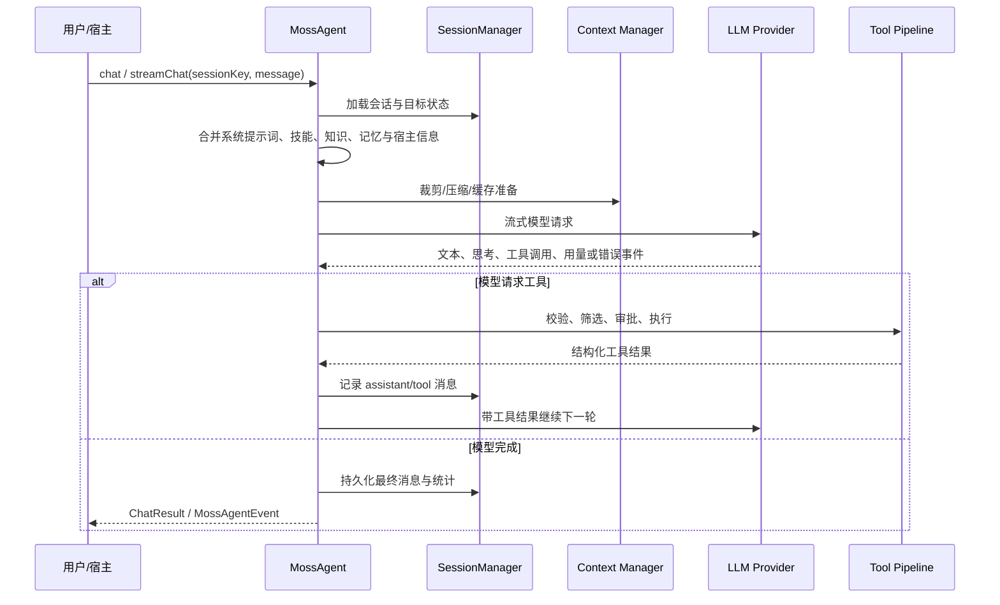

# Moss 完整技术架构、实现方案与项目交接上下文

> 本文参考 `api-controller-center` 的技术方案组织方式，按照“需求总结 → 现状与痛点 → 目标 → 总体架构 → 分模块流程、数据与接口 → 质量与交付 → 演进与接手”的结构，系统整理 Moss 当前完整上下文。
>
> 编制依据包括：当前 Moss 工作区源码、公开文档、测试与基准、全部 Git 可达提交、Claude Code 历史会话和 Codex 历史会话。历史对话仅做匿名化聚合，不复制私密原文。

## 文档状态

| 项目             | 基线                                                                     |
| ---------------- | ------------------------------------------------------------------------ |
| 编制日期         | 2026-07-16                                                               |
| Git 基线         | `880e370f253c030b6ed576f104c7303179952b53`                               |
| Git 提交覆盖     | `git log --all` 共 611 个可达提交                                        |
| Claude Code 历史 | 33 个会话、596 条用户消息                                                |
| Codex 历史       | 564 个相关会话、5149 条用户消息                                          |
| 当前包版本       | `@rdk-moss/core@0.5.3`、`@rdk-moss/agent@0.5.3`、`create-moss-app@0.4.2` |
| Node.js 要求     | `>=22.16.0`                                                              |
| 工作区说明       | 编制时工作区存在其他未提交代码改动；本文不覆盖这些改动，只新增文档       |

关联材料：

- [完整提交演进索引](./moss-commit-history.md)
- [历史对话决策索引](./moss-conversation-decisions.md)
- [Host Adapter 契约](./host-adapter-contract.md)
- [环境变量清单](./env-vars.md)
- [Agent Harness 基准](./agent-harness-benchmark.md)
- [Agent 效率基准](./agent-efficiency-benchmark.md)

---

## 一、需求总结

### 1.1 产品问题

通用大模型可以生成文本或调用工具，但把它变成真正可用于软件工程和机器人开发的 Agent，需要解决一整套运行时问题：

1. 如何稳定地执行多轮“模型 → 工具 → 结果 → 再推理”循环。
2. 如何处理长任务、上下文压缩、暂停恢复、用户中途追加指令和子 Agent 协作。
3. 如何在本地文件、命令、网络、SSH、机器人设备等高风险工具上实施权限和安全边界。
4. 如何支持多个模型服务商，同时诚实展示实际模型、错误、重试、token 和成本。
5. 如何让 CLI/TUI 可独立使用，同时允许 RDK Studio 或其他宿主嵌入同一运行时。
6. 如何将机器人知识和设备能力做成可插拔能力，而不是把厂商和板卡逻辑硬编码进核心。
7. 如何使会话、记忆、技能、观测、评测和发布流程成为可维护的工程系统。

### 1.2 Moss 的产品定义

Moss 是一个面向日常软件开发、办公任务和机器人开发的跨平台 Agent Harness：

- **独立使用**：通过 `moss` CLI/TUI 直接对话、修改代码、运行命令、管理会话和执行长期任务。
- **嵌入使用**：通过 `@rdk-moss/agent` 和 `@rdk-moss/core` 将 Agent 循环、工具、记忆、技能和宿主契约嵌入其他产品。
- **主机中立**：核心运行时不绑定 RDK Studio、特定 IDE、特定机器人品牌或单一模型服务商。
- **机器人增强**：机器人知识、设备连接、ROS、诊断和厂商能力通过模块、工具和 Host Adapter 加载。

### 1.3 核心成功标准

一个完整的 Moss 交付应满足：

- 用户能从零配置或显式配置启动 Agent。
- Agent 能进行流式多轮执行，可靠处理工具调用与失败。
- 用户能观察任务状态、追加指令、暂停、恢复或终止长任务。
- 会话和关键状态可持久化，压缩后不丢失任务语义。
- 工具调用经过注册、筛选、审批、hook、脱敏和结果归一化。
- 模型故障有分类、重试和可解释降级，不伪造成功。
- 宿主可以通过稳定契约声明能力并检查兼容性。
- 软件工程 Agent 在无机器人设备时仍完整可用。
- 机器人能力在连接设备后自然增强，而不是污染通用核心。
- 构建、类型检查、lint、测试、基准和边界检查有统一验证入口。

---

## 二、现状与历史痛点

### 2.1 项目现状

Moss 当前是 npm workspaces 管理的 TypeScript monorepo：

```text
moss/
├── packages/
│   ├── moss/                 # @rdk-moss/core：稳定、主机中立的公共契约
│   ├── moss-agent/           # @rdk-moss/agent：Agent 运行时、CLI/TUI 与能力模块
│   └── create-moss-app/      # create-moss-app：项目脚手架
├── benchmarks/               # Agent Harness 与效率基准数据
├── docs/                     # 契约、设计、审计、环境变量和本文档
├── scripts/                  # 验证、发布、冒烟、边界和基准脚本
├── CHANGELOG.md              # 版本级变更事实
├── PRODUCT.md                # 精简产品定义
├── README.md / README_CN.md  # 用户入口
└── package.json              # 工作区统一验证入口
```

当前源码规模包括约 318 个 `moss-agent` TypeScript 文件、13 个 `core` TypeScript 文件以及 123 个包级测试文件。规模说明 Moss 已不是简单聊天 CLI，而是包含运行时、交互层、扩展层和工程保障的完整系统。

### 2.2 历史中反复出现的痛点

611 次提交和历史会话表明，项目重点长期集中在以下问题：

1. **Agent 循环可靠性**：工具重试、流结束、thinking-only 响应、重复完成、后台任务和取消竞态。
2. **上下文连续性**：压缩后丢工具配对、丢目标、丢计划、长会话 token 失控或错误重放。
3. **TUI 一致性**：输入、队列、状态、工具结果、审批、侧聊和子 Agent 面板曾存在多套显示方式。
4. **工具边界**：路径穿越、TOCTOU、SSRF、命令生命周期、预先 abort、SSH 卡死和密钥泄露。
5. **模型诚实性**：底层模型识别、Provider 错误归一化、重试策略、缓存资格和成本报告。
6. **嵌入耦合**：CLI 内部创建服务、宿主能力声明不完整、公开子路径与主 barrel 漂移。
7. **机器人与通用能力平衡**：既要突出设备/ROS 能力，又不能让通用软件 Agent 依赖具体板卡。
8. **质量闭环**：功能“看起来实现”但运行时无人读取、测试只覆盖代码路径而不覆盖契约。

### 2.3 已经明确的架构原则

这些原则已经由代码、文档和多轮会话共同收敛：

- 核心包只承载稳定契约和通用提示词，不承载 CLI 发现逻辑。
- Agent 运行时通过依赖注入组合 Provider、SessionStore、Knowledge、Tools 和宿主能力。
- CLI/TUI 是参考宿主，不是运行时唯一入口。
- 平台和厂商能力通过 KnowledgeModule、PlatformExtension、VendorPlugin、Capability Pack 或 Host Adapter 注入。
- 新字段必须被运行时读取；新能力必须 Declare + Enforce + Test。
- 异步资源必须处理预先取消、成功/失败清理和不可忽略的终止。
- 安全失败倾向 fail closed；用户可恢复的配置错误必须提供明确操作路径。
- “不要改”同样是架构结论：Provider 抽象、Host Adapter 契约、核心/CLI 分层和机器人能力插件化应继续保持。

---

## 三、目标与非目标

### 3.1 当前目标

1. 提供可靠的通用 Agent 执行循环。
2. 提供适合长时间软件工程任务的上下文和目标管理。
3. 提供可用、可解释、可恢复的 CLI/TUI 体验。
4. 提供本地、远端设备和机器人开发工具面。
5. 提供主机中立、可版本化的嵌入契约。
6. 提供多 Provider、技能、知识、记忆、MCP 和扩展组合能力。
7. 提供完整的测试、基准、观测、配置审计和发布验证。

### 3.2 明确非目标

- 不在核心包中硬编码某个机器人品牌、板卡型号或 Studio 页面流程。
- 不把所有流行 Agent 框架功能当作必须补齐的“特性清单”。
- 不通过隐藏 Provider 或伪造 token/成本来制造统一体验。
- 不把 CLI 全局单例当成嵌入 API。
- 不用多个互相覆盖的 Markdown 文件承担跨会话记忆。
- 不保证外部工具和模型服务永不失败；目标是失败可见、可分类、可恢复。

---

## 四、总体架构

### 4.1 分层架构

```mermaid
flowchart TB
    User[用户 / 宿主产品] --> Host[CLI TUI / RDK Studio / 自定义宿主]
    Host --> Contract[@rdk-moss/core\nHost Adapter 与领域契约]
    Host --> Agent[MossAgent]

    Agent --> Loop[Agent Loop]
    Agent --> Session[Session / Context / Goal]
    Agent --> Registry[Tool / Skill / Knowledge / Extension Registries]
    Agent --> Runtime[Memory / MCP / Mesh / Channels / Observability]

    Loop --> Provider[LLM Provider / Multi-Provider Router]
    Loop --> Tools[Tool Execution Pipeline]
    Loop --> Compact[Compaction / Pruning / Cache]

    Tools --> Local[Files / Exec / Patch / Search / Browser]
    Tools --> Device[SSH / Device / ROS / Diagnostics]
    Tools --> External[MCP / Host Tools / Platform Extensions]

    Provider --> Models[OpenAI-compatible / Anthropic / pi-ai adapters]
    Session --> Storage[JSONL sessions / memory index / journals]
```

### 4.2 包职责

| 包                | 职责                                                                           | 稳定性预期                   |
| ----------------- | ------------------------------------------------------------------------------ | ---------------------------- |
| `@rdk-moss/core`  | Knowledge、Platform、Vendor、Device、Host Adapter、Async Task 契约与工程提示词 | 面向嵌入方，优先保持稳定     |
| `@rdk-moss/agent` | Agent 循环、Provider、工具、会话、上下文、CLI/TUI、MCP、记忆、技能等完整实现   | 快速演进，但公开子路径需兼容 |
| `create-moss-app` | 新项目脚手架和模板                                                             | 用户入口，需保持简单可运行   |

### 4.3 运行时组合根

`MossAgent` 是运行时组合根，定义位于 `packages/moss-agent/src/core/agent/moss-agent.ts:179`。其配置契约位于 `packages/moss-agent/src/core/agent/moss-agent-types.ts:151`。

主要注入或持有：

- `LLMProvider`
- `SessionStore`
- `KnowledgeRegistry`
- `ToolRegistry`
- `PlatformExtensionRegistry`
- `ToolHookRegistry`
- `CommandQueueRegistry`
- `SpawnProfileRegistry`
- `MossAsyncTaskRegistry`
- 上下文、压缩、提示词、缓存和执行策略

这使同一 Agent 核心可以由 CLI、测试、桌面宿主或其他 Node.js 应用构造。

---

## 五、核心调用流程

### 5.1 一次对话的主流程



### 5.2 Agent Loop 的职责

Agent Loop 被拆分为类型、状态、流处理、工具执行、压缩、完成判定等模块，避免所有行为集中在单个巨型函数中。核心职责包括：

1. 构造每轮 Provider 请求。
2. 消费流式事件并维护可见输出。
3. 收集和规范化工具调用草稿。
4. 依序或并行执行允许的工具调用。
5. 将工具结果转换成模型和会话都能理解的消息。
6. 判断继续、重试、压缩、失败或完成。
7. 保护 run epoch，避免旧流向新运行推送事件。
8. 对 thinking-only 响应只做有限纠正，避免无限模型调用。
9. 在 hard caps、abort、错误和完成时给出明确原因。

### 5.3 用户运行中控制

Moss 不把一次 Agent 运行视为不可干预的黑盒。运行时支持：

- Session Inbox：运行中注入新的用户指令。
- 提示词队列：排队、查看、删除、暂停和恢复后续输入。
- BTW/侧聊：在主任务不被破坏的前提下回答临时问题。
- Goal：创建、查看、暂停、恢复、完成、阻塞和清除长期目标。
- LoopScheduler：重复执行目标驱动的迭代。
- Abort：取消当前流、工具或后台任务。
- Subagent：将边界清晰的子任务交给独立上下文执行。

---

## 六、核心模块设计

### 6.1 Agent 配置与事件模型

`MossAgentConfig` 把运行时配置拆为多个关注点：Provider、上下文管理、工具执行、提示词、缓存、知识、能力包、steering、异步任务等。`ChatOptions` 控制单次调用，`ChatResult` 返回完成结果，`MossAgentEvent` 则为流式宿主提供细粒度状态。

设计原则：

- 构造级配置描述长期依赖与策略。
- 调用级选项描述本次运行差异。
- 事件流描述用户可观察状态，不要求宿主解析内部对象。
- 新事件或能力应兼容旧宿主，必要时通过 Host Adapter capability 声明。

### 6.2 Provider 与模型路由

Provider 层统一模型调用协议，主要实现包括：

- `OpenAILLMProvider`：`packages/moss-agent/src/provider/openai.ts:54`
- `AnthropicLLMProvider`：`packages/moss-agent/src/provider/anthropic.ts:130`
- `PiAiLLMProvider`：`packages/moss-agent/src/provider/pi-ai-adapter.ts:130`
- `MultiProviderRouter`：`packages/moss-agent/src/provider/multi-provider-router.ts:76`

统一关注点：

1. 文本、多模态和工具 schema 转换。
2. 流式事件解析与结束原因。
3. Provider 错误结构化和可重试判断。
4. thinking、可见文本和工具调用的边界。
5. token 使用、缓存命中和成本信息。
6. 超时、abort 和资源清理。

Multi-Provider Router 提供显式 fallback、最大重试和 cooldown。它不应隐藏实际模型；宿主应展示最终 Provider 和模型事实。

### 6.3 Session 与消息持久化

`SessionManager` 位于 `packages/moss-agent/src/core/session/session-manager.ts:46`，默认目录为 `./.moss/sessions`。会话使用 JSONL 持久化，支持：

- 加载和追加消息。
- 消息树和 parent/leaf 关系。
- 清理尾部 assistant 消息。
- regenerate 前截断。
- compaction 记录。
- 会话清除和列表。
- legacy 文件名兼容。
- 内存 session cache 的数量与近似字节上限。

会话文件是运行事实来源；TUI 的“最近会话”只是其视图，不应另建冲突状态。

### 6.4 上下文管理与压缩

上下文模块负责在模型窗口限制内保留最有价值的信息：

- pruning：删除低价值或可重建内容。
- deterministic compaction：规则化压缩。
- LLM compaction：由模型生成摘要。
- remote compaction：由远端服务压缩。
- micro-compaction：小步压缩。
- tail tool snip：截断过长工具尾部。
- prompt cache：保持可缓存前缀稳定并记录资格指标。

关键不变量：

1. assistant 工具调用与 tool result 必须成对。
2. 当前目标、未完成计划和关键用户约束不能因压缩消失。
3. 压缩失败必须按明确策略降级，而不是静默丢历史。
4. compaction 记录进入会话，使恢复行为可解释。
5. 缓存优化不能改变语义或隐藏实际 token 使用。

### 6.5 Goal、Loop 与长期任务

`MossAgent` 暴露 `setGoal/getGoal/pauseGoal/resumeGoal/completeGoal/blockGoal/clearGoal`。`LoopScheduler` 位于 `packages/moss-agent/src/core/loop/loop-scheduler.ts:124`。

长期任务由三层构成：

- **GoalState**：用户目标和状态机。
- **LoopScheduler**：按照预算、间隔、停止条件和恢复状态运行多次迭代。
- **LoopJournal/事件**：记录每次迭代的开始、完成、错误和停止原因。

长期任务必须满足：

- 每次迭代有明确成功检查。
- 停止后可读取最后状态。
- 恢复从最近 checkpoint 继续，而不是重新解释原始大目标。
- blocked 与普通失败区分；不能因为任务困难就伪报 blocked。
- token、时间、工具调用和迭代次数有上限。

### 6.6 Subagent 与任务委派

Subagent 用于隔离上下文、并行处理边界明确的任务。其适用条件是：

- 子任务可独立定义输入和完成标准。
- 写入范围可隔离或任务只读。
- 主路径下一步不立即依赖结果，能够并行推进。

不应把紧急阻塞任务交给子 Agent 后原地等待，也不应让多个 Agent 重复分析同一问题。宿主通过事件面展示子 Agent 任务、进度、结果和失败。

### 6.7 Tool Registry 与执行管线

`ToolRegistry` 位于 `packages/moss-agent/src/core/tools/tool-registry.ts:25`，支持单工具和 ToolGroup 注册。

工具执行不是直接调用 handler，而是经过：

```text
模型工具调用
  → 名称与参数校验
  → ToolFilter / 能力过滤
  → 安全策略与审批
  → pre-tool hooks
  → handler 执行、超时与 abort
  → post-tool hooks
  → 密钥脱敏与结果归一化
  → 会话记录、事件和观测
```

主要内置工具面：

- 文件：`read_file`、`write_file`、`edit_file`、`move_file`、`list_directory`
- 搜索：`search_files`、`search_code`
- 修改：`apply_patch`
- 命令：`exec`、`exec_background`、`exec_logs`、`exec_stop`
- 工程：`run_tests`、`verify_fix`、`code_diagnostics`
- 浏览器：`web_browser_fetch`、`web_browser_control`
- 截图：`screenshot_capture`
- 设备：`device_exec`、`device_info`、远端文件和健康检查
- ROS：ROS1/ROS2 topic、node、service、launch、package 工具
- 诊断：温度、资源、进程、网络、相机和机器人状态
- Fleet：批量设备操作
- Skill：`install_skill`

### 6.8 工具 Hook 与结果安全

ToolHookRegistry 允许宿主和运行时在工具前后执行策略。默认 post hook 会进行 secret sanitization，并同步用于 trace redaction。

Hook 的典型用途：

- 审计与遥测。
- 宿主权限检查。
- 参数重写或阻止高风险调用。
- 工具结果脱敏。
- 领域特定结果投影。

Hook 不能替代工具自身的参数校验和资源清理；安全需多层执行。

### 6.9 Safety 与 Approval

安全层覆盖：

- 工作区路径边界和 realpath 检查。
- 文件写入前的 stale-read/TOCTOU 防护。
- 命令和危险操作审批。
- trusted/denied tool policy 和 glob 匹配。
- channel 输入安全。
- web fetch 的 DNS/SSRF 防护。
- 密钥、token、连接串和敏感输出脱敏。
- prompt injection 风险隔离。
- 非交互模式下的明确拒绝和恢复指引。

审批策略在 CLI 层可配置，但最终授权结果必须传入运行时执行路径，不能只影响 UI 文案。

### 6.10 本地进程与异步资源生命周期

命令、后台任务和 SSH 是高风险异步资源。实现要求：

1. 启动前检查 `signal.aborted`。
2. close、error、timeout、abort 均调用统一 cleanup。
3. 终止不可控子进程时使用可靠的进程树清理。
4. 工具 Promise 只有在可观察副作用完成后才能 resolve。
5. 后台任务必须返回 task id，并提供日志和停止接口。
6. 持久化或事件写入失败不能静默改变“任务已完成”的语义。

### 6.11 Knowledge

`KnowledgeRegistry` 位于 `packages/moss-agent/src/knowledge/registry.ts:28`，消费 `@rdk-moss/core` 的 KnowledgeModule 契约。

KnowledgeModule 用于提供：

- 设备、平台、SDK、命令或领域知识。
- 可检索记录及元数据。
- 与平台无关的提示词上下文。
- 可更新或打包的知识源。

Knowledge 与 Tool 的区别：Knowledge 主要回答“知道什么”，Tool 负责“能执行什么”。两者可以协同，但不能混成不可测试的隐式提示词。

### 6.12 Skill 与 Skill Learning

`SkillRegistry` 位于 `packages/moss-agent/src/skills/registry.ts:174`。Skill 是包含明确触发条件、工作流和工具使用规范的可发现能力。

Skill 系统关注：

- 发现全局、项目和内置 skill。
- 解析 `SKILL.md` 元数据和正文。
- 根据用户任务选择相关 skill。
- 向模型提供有限、按需加载的指令。
- 安装和更新 skill。
- 将重复成功模式沉淀为新 skill。

Skill 不是简单的长提示词拼接；触发、作用域、工具依赖和失败处理都属于契约。

### 6.13 Memory 与 Learning

`MemoryManager` 位于 `packages/moss-agent/src/memory/memory-manager.ts:270`。它提供 workspace、user、device、learning 等 scope，并支持：

- 加载、写入、更新和删除。
- pinned 状态。
- 搜索、查询变体和 digest。
- secret redaction 与写入校验。
- 过期和硬删除策略。
- 索引体积软限制。

长期记忆和会话历史的区别：

- 会话保存“发生了什么”。
- Memory 保存“未来仍有价值的事实或偏好”。
- Learning 保存“可复用的方法和经验”。

不应把所有对话自动写入长期记忆，也不应使用独立 `MEMORY.md` 与 MemoryManager 形成双重事实源。

### 6.14 Teaching

Teaching 层将 Agent 的工具调用和推理过程转换为可学习、可解释的输出。例如在执行命令时解释命令目的、风险和结果。它是可选体验层，不能阻塞核心执行，也不能泄露私有推理内容。

### 6.15 Platform Extension 与 Capability Pack

`PlatformExtensionRegistry` 位于 `packages/moss-agent/src/extensions/registry.ts:28`。PlatformExtension 将宿主或平台能力注册到 Agent；Capability Pack 则组合工具组、提示词层和宿主能力要求。

适合放入扩展的内容：

- 特定 IDE 或桌面应用动作。
- 特定机器人平台工具。
- 宿主 UI 状态或工作区能力。
- 企业内部服务连接。

不适合放入核心的内容应优先以扩展实现。

### 6.16 MCP

MCP 模块连接外部 MCP Server，并将其工具投影到 Moss Tool Registry。主要职责：

- 读取 MCP 配置。
- 启动 stdio/网络连接。
- 容忍非 JSON 日志和部分服务器失败。
- 获取工具清单并转换 schema。
- 路由调用和错误。
- 在 doctor 中展示健康状态。
- 保持 cwd、环境变量和进程生命周期可控。

单个 MCP Server 失败不应让全部 Agent 无法启动；但对应工具必须明确标记不可用。

### 6.17 Agent Mesh 与 Channels

`AgentMesh` 位于 `packages/moss-agent/src/mesh/agent-mesh.ts:45`。Mesh 与 Channels 为多 Agent、远端 Agent 和消息入口提供基础能力。

- Mesh：发现、连接、能力描述、事件与任务协调。
- Channel：将外部消息转换成 session-scoped 请求，并按会话串行化，避免同一会话并发破坏顺序。
- Backplane：宿主可以用能力声明表示 task、channel 和 result surface，而不是依赖 CLI 组件。

### 6.18 Observability

Observability 贯穿 Provider、Agent Loop、工具和长期任务：

- trace/span 与事件。
- Provider 延迟、重试、错误类型。
- token、缓存和成本。
- 工具调用时长、结果和失败。
- compaction 原因和效果。
- loop/subagent 进度。
- secret redaction。

观测数据不能改变运行结果；观测失败应降级，但敏感信息脱敏失败不能默认为可接受。

### 6.19 Structured Output

Structured Output 模块提供：

- 结构化输出工具。
- 系统提示词构造。
- `StructuredOutputEnforcer` 运行时校验。
- headless CLI 的 JSON 输出路径。

严格输出模式必须真正校验最终结果，而不是只要求模型“请输出 JSON”。失败时应给出明确错误或有限修复，而不是返回格式错误的成功结果。

### 6.20 Vision 与 Browser

Vision 用于处理图片输入和视觉内容；Browser 工具用于网页获取和交互。二者都必须经过能力判断：

- Provider 不支持视觉时应明确拒绝或降级。
- 浏览器 fetch 与控制是不同风险等级。
- 网络访问必须执行 URL、DNS、重定向和内容大小限制。
- 页面内容属于不可信输入，不能直接提升为系统指令。

### 6.21 Plan-Execute 与 Eval

Plan-Execute 用于将复杂任务拆为可验证步骤；Eval 用于运行固定场景并评估 Agent 行为。它们服务于工程质量，而不是强制所有任务都进入重型规划。

当前基准重点覆盖：

- 预先取消的子进程。
- 需要联网验证的时效性任务。
- TUI 手动压缩。
- 运行中 BTW。
- 可停止/恢复的自主循环。
- 跨模块缓存失效 TDD。
- 严格结构化输出。
- token/成本诚实性。
- 简单任务效率。
- skill 精确路由。

### 6.22 CLI、配置与 TUI

CLI 入口是 `packages/moss-agent/src/cli.ts`，实际命令初始化和 dispatch 位于 CLI 模块。CLI 负责：

- Node 版本检查。
- setup/auth/config/mcp/migrate/sessions 等命令。
- 工作区和项目配置加载。
- Provider/模型发现与选择。
- Agent 依赖组装。
- headless 输出。
- 交互式 TUI。
- doctor、权限、会话和运行状态视图。

TUI 负责展示但不拥有核心业务状态。重要视图包括：

- 欢迎与 recent activity。
- 对话流和 streaming。
- 工具调用与结果。
- 审批和权限来源。
- 输入编辑、历史和补全。
- prompt queue。
- BTW/侧聊。
- Goal/Loop/Subagent 状态。
- token、缓存、Provider 和错误信息。

### 6.23 机器人与设备能力

机器人能力通过设备工具、ROS 工具、Knowledge 和扩展组合实现：

- SSH 连接和会话复用。
- 设备信息、文件、命令和健康状态。
- ROS1/ROS2 topic、node、service、launch 和 package 操作。
- 温度、CPU/内存、进程、网络、相机和机器人服务诊断。
- 多设备批处理。

设备能力的关键边界：

- 连接配置属于宿主/用户环境，不写死在包中。
- 设备输出是不可信文本，需要脱敏和长度控制。
- SSH 卡死必须可取消和强制清理。
- 无设备时只隐藏/禁用相关工具，不影响通用 Agent。

---

## 七、Host Adapter 与嵌入契约

### 7.1 契约目的

Host Adapter 解决“同一 Moss 运行时如何被不同宿主安全嵌入”的问题。`MossHostRuntimeManifest` 定义于 `packages/moss/src/contracts/host-adapter.ts:330`，兼容性检查函数 `evaluateMossHostCompatibility()` 定义于同文件 `:1148`。

Manifest 描述：

- 宿主和 adapter 版本。
- 已支持 capability。
- tool surface 与 result surface。
- approval、side effect 和 progress 能力。
- task surface 与 channel backplane。
- 异步任务和 observability 能力。
- readiness 与降级状态。

### 7.2 兼容性原则

1. Manifest 必须在运行前校验。
2. 新增可选字段尽量保持 v1 兼容。
3. 破坏语义时提升 contract version。
4. 能力声明必须由运行时实际读取和投影。
5. 宿主缺少能力时返回 degraded/unsupported，而不是假装完整支持。
6. CI 应执行兼容性检查和 fixture/conformance 测试。

### 7.3 宿主最小接入步骤

```ts
import { MossAgent, type MossAgentConfig } from '@rdk-moss/agent';
import {
  evaluateMossHostCompatibility,
  type MossHostRuntimeManifest,
} from '@rdk-moss/core/contracts/host-adapter';

const compatibility = evaluateMossHostCompatibility(hostManifest);
if (!compatibility.compatible) {
  throw new Error(compatibility.summary);
}

const agent = new MossAgent(agentConfig);
for await (const event of agent.streamChat('session-id', '用户消息')) {
  renderEvent(event);
}
```

宿主应自行实现事件到 UI 的映射，而不是依赖 CLI 的 React 组件。

---

## 八、数据与状态设计

### 8.1 状态分类

| 状态          | 典型存储                           | 生命周期           | 事实来源            |
| ------------- | ---------------------------------- | ------------------ | ------------------- |
| 会话消息      | `.moss/sessions/*.jsonl`           | 跨进程             | SessionManager      |
| Goal/Loop     | goal store / journal               | 跨迭代，可恢复     | Goal/Loop 模块      |
| 长期记忆      | MemoryManager 数据目录             | 跨会话             | MemoryManager       |
| 技能          | 全局/项目 skill 目录               | 长期               | SkillRegistry       |
| 配置          | 用户、项目、显式配置文件与环境变量 | 启动/运行期        | ConfigManager       |
| MCP           | MCP 配置与连接状态                 | 运行期             | MCP manager         |
| 后台任务      | AsyncTaskRegistry / 进程状态       | 运行期或宿主持久化 | Async task contract |
| TUI 临时状态  | 内存                               | 当前进程           | TUI state           |
| Trace/metrics | observer/exporter                  | 可配置             | Observability       |

### 8.2 数据一致性规则

- 写会话时先更新可恢复结构，再报告完成。
- append 失败必须回滚内存 leaf/索引，避免内存和磁盘分叉。
- compaction 作为显式会话 entry，不覆盖原始历史文件而无记录。
- 记忆写入先校验和脱敏。
- 后台任务状态必须有唯一 id 和单调状态转换。
- 多实例运行时的可变状态应实例隔离，除非明确声明共享 singleton。
- sessionKey 相同的并行运行需要 epoch/queue 保护。

### 8.3 隐私与历史资料处理

Claude/Codex 原始历史可能包含路径、附件、日志和敏感上下文，因此本文档体系只保存：

- 数量和时间范围。
- 主题聚合。
- 已经稳定的工程决策。
- 可回到当前代码验证的结论。

原始对话不应提交到 Moss 仓库。

---

## 九、公开 API 与可发现性

### 9.1 `@rdk-moss/core`

主要导出：

- KnowledgeModule
- VendorPlugin
- PlatformExtension
- DeviceFamily
- Host Adapter
- Async Task
- Robotics / Software Engineering prompts

这些契约同时从相应 subpath 和主 barrel 可发现。新增 subpath 时必须检查主 barrel 是否需要同步导出。

### 9.2 `@rdk-moss/agent`

当前公开 subpath 包括：

- `.`
- `knowledge`
- `extensions`
- `safety`
- `channels`
- `prompts`
- `skills`
- `core`
- `goal`
- `utils`
- `context`
- `provider`
- `tools/builtin`
- `mesh`
- `observability`
- `mcp`
- `memory`
- `skill-learning`
- `teaching`
- `vision`
- `web-browser`
- `structured-output`
- `eval`
- `plan-execute`

公开 API 变更要求：

1. 检查 `package.json` exports。
2. 检查主 `src/index.ts` 可发现性。
3. 检查类型导出快照或 API 测试。
4. 更新 README、CHANGELOG 和迁移说明。
5. 若弃用，提供 since/removal target 和可复制迁移示例。

---

## 十、配置与环境

### 10.1 配置来源

配置可能来自：

- CLI 参数。
- 显式配置文件。
- 项目级配置。
- 用户级配置。
- 环境变量。
- 宿主直接注入的 `MossAgentConfig`。

优先级必须可解释，并通过 `moss config` 或 doctor 展示 resolved config 和警告。不得打印 secret 值。

### 10.2 配置领域

完整环境变量见 [env-vars.md](./env-vars.md)，主要覆盖：

- Profile 与基础配置。
- 安全和审批。
- SSH/设备连接。
- 执行 backend。
- Agent Loop 与预算。
- MCP。
- Mesh。
- 日志和观测。
- TUI。
- Provider 内部行为。
- 多 Provider fallback。
- Teaching。
- CodeGraph。
- Eval。
- 更新检查。
- Hook 脚本环境。

### 10.3 配置错误处理

- 无效值在启动早期报告。
- 冲突策略给出 audit warning。
- 代理环境变量需在子进程边界正规化，避免不支持的 proxy scheme 导致服务启动崩溃。
- 非交互模式不能弹审批，应拒绝并给出可执行的恢复命令。
- doctor 只展示变量名和风险，不泄露值。

---

## 十一、安全与可靠性方案

### 11.1 威胁模型

主要不可信输入包括：

- 用户提示词和粘贴内容。
- 模型输出和工具参数。
- 网页、MCP Server、设备和命令输出。
- 项目内指令文件和 skill。
- 外部 Provider 错误体。
- 文件系统符号链接和并发修改。

### 11.2 安全控制

| 风险              | 控制                                      |
| ----------------- | ----------------------------------------- |
| 路径穿越          | workspace root、realpath、父子路径校验    |
| TOCTOU            | 读取状态记录、写前重新校验、原子操作      |
| SSRF              | URL 解析、DNS 私网检测、超时、重定向复检  |
| Prompt injection  | 内容来源分层、工具权限不由网页文本提升    |
| Secret 泄露       | 工具结果、trace、日志和 memory 写入脱敏   |
| 命令破坏          | 审批、policy、sandbox/工作区边界、timeout |
| 子进程泄露        | abort 前检、listener cleanup、进程树终止  |
| 会话并发          | session queue、run epoch、消息序列化      |
| 重放/重复完成     | run id、状态机和 completion gating        |
| Provider 无限重试 | 有界 retry、cooldown、明确最终错误        |

### 11.3 可靠性降级

- 单个 MCP 服务失败：其他服务和本地工具继续运行。
- 首选 Provider 失败：符合策略时切换 fallback。
- LLM compaction 失败：降级到确定性策略。
- 观测 exporter 失败：记录警告，不中断任务。
- 设备离线：禁用设备工具，不影响本地 Agent。
- TUI 渲染问题：核心事件仍可由 headless/宿主消费。
- 缓存不可用：回退到无缓存请求，不改变语义。

---

## 十二、测试、基准与验证

### 12.1 验证入口

根目录统一命令：

```bash
npm run check:boundaries
npm run check:hygiene
npm run check:agent-harness-benchmark
npm run build
npm run typecheck
npm run lint
npm run test
npm run verify
```

`npm run verify` 顺序执行边界、卫生、基准、构建、类型检查、lint 和完整测试。

### 12.2 测试层次

1. **单元测试**：纯函数、解析、状态机、策略和 schema。
2. **契约测试**：公开 API、Host Adapter、Provider、SessionStore、Tool 结果。
3. **回归测试**：原始 bug 在修复前应失败。
4. **集成测试**：Agent + Provider fixture + Tool + Session。
5. **CLI/TUI 测试**：命令 dispatch、输入、队列、审批和显示模型。
6. **基准场景**：真实 Agent 任务的质量、效率和诚实性。
7. **发布冒烟**：打包后 CLI、exports、权限和跨平台路径。

### 12.3 Bug 修复完成标准

每个修复必须回答：

- Declare：结构、类型或契约改了什么？
- Enforce：运行时哪里读取并执行？
- Test：哪条测试在修复前失败？
- Siblings：同类问题是否在其他模块出现？
- Full verify：完整验证是否发现无关或相关回归？

### 12.4 文档验证

本文档属于上下文和交接文档，验证方式是：

- 路径存在。
- 符号和公开 subpath 与当前源码一致。
- 版本和提交统计可重算。
- 已实现与设计中内容明确区分。
- 命令与 package scripts 一致。
- 不含原始私密会话和 secret。

---

## 十三、演进时间线

完整逐提交记录见 [moss-commit-history.md](./moss-commit-history.md)。以下为阶段归纳，不替代提交事实。

### 13.1 2026-05：运行时与契约奠基

- 建立开源 workspace 和 `@rdk-moss/core`。
- 定义 Host Adapter、Knowledge、平台扩展和机器人提示词。
- 引入 Agent Mesh、Goal Mode、Subagent progress 和 observability。
- 加固 SSRF、路径、注入、SSH、channel 序列化和工具安全。
- 重构 core 模块和结构化工具结果。

### 13.2 2026-06：CLI/TUI、权限和上下文成熟

- 大量完善 TUI frame、输入、队列、审批、工具结果和会话体验。
- 建立 trusted/denied tool policy、配置审计和 doctor。
- 完善 compaction、prompt cache、Provider fallback 和 MCP。
- 增强嵌入能力、公开 exports 和 Host Adapter 文档。
- 增加自主循环、记忆、技能、教学、浏览器和机器人工具。
- 持续处理真实 dogfooding 发现的长任务和交互问题。

### 13.3 2026-07：产品收敛与质量强化

- TUI 向统一、现代且可解释的交互模型收敛。
- 系统提示词、Agent 指令和记忆来源进一步去重。
- 强化 headless、结构化输出、成本报告和跨平台 CI。
- 完成多轮模块拆分、依赖注入和错误分类重构。
- 通过 Claude/Codex 长时间 dogfooding 继续修复任务连续性、设备连接和 UI 细节。

---

## 十四、当前边界、已知缺口与“不要误读”

### 14.1 当前已实现

- 可嵌入 `MossAgent` API。
- CLI/TUI 与 headless 使用路径。
- 多 Provider 与 fallback。
- 会话、压缩、Goal、Loop、Subagent 和运行中 steering。
- 本地文件/命令/搜索/patch/后台任务工具。
- MCP、Memory、Skill、Knowledge、Teaching、Mesh、Channels。
- SSH、设备诊断、ROS 和 fleet 工具。
- Host Adapter contract 与 compatibility evaluation。
- 边界、卫生、基准、构建、类型、lint 和测试验证链。

### 14.2 仍需持续验证或演进

- 不同宿主对 Host Adapter 全部 surface 的真实覆盖程度。
- 长时间、多 session、多实例并发下的资源和状态隔离。
- 外部 Provider 对 token、缓存、thinking 和成本字段的一致性。
- MCP Server 的多实现兼容性和异常输出。
- 真实设备网络抖动、SSH 进程树和 ROS 环境差异。
- TUI 在不同终端、窗口大小和输入法下的交互一致性。
- 自主循环的长期质量、预算控制和错误恢复。

### 14.3 历史设计文档不等于当前实现

`self-iteration-design.md`、`soul-md-design.md`、`embeddability-audit.md` 等记录了某个时间点的设计或审计。阅读顺序应是：

1. 当前源码和测试。
2. CHANGELOG 和公开 README。
3. 本文档的现状归纳。
4. 历史设计文档，用于理解“为什么”。

如果历史文档与当前源码冲突，以源码、测试和最新契约为准，并更新文档。

### 14.4 不建议轻易改动的部分

- 不要把宿主发现逻辑重新塞进 `@rdk-moss/core`。
- 不要绕过 Tool Registry 直接从模型调用系统资源。
- 不要让 TUI 成为 Goal、Session 或 Approval 的唯一状态源。
- 不要用隐藏模型身份换取“统一品牌体验”。
- 不要恢复多个 Markdown 长期记忆源。
- 不要把某块板卡流程硬编码进通用 Agent Loop。
- 不要为了对齐其他框架而加入没有真实场景的抽象。

---

## 十五、新同事接手指南

### 15.1 30 分钟快速理解

按以下顺序阅读：

1. `PRODUCT.md`：产品一句话和核心边界。
2. `README_CN.md`：用户入口和主要能力。
3. 本文：完整系统地图。
4. `packages/moss-agent/src/core/agent/moss-agent-types.ts`：组合配置和事件模型。
5. `packages/moss-agent/src/core/agent/moss-agent.ts`：运行时组合根。
6. `packages/moss-agent/src/core/loop/`：Agent 执行流程。
7. `packages/moss/src/contracts/host-adapter.ts`：嵌入边界。
8. 与任务相关的模块和测试。

### 15.2 第一次本地验证

```bash
npm install
npm run build
npm run typecheck
npm run test
```

准备提交前运行：

```bash
npm run verify
```

如只修改一个模块，先运行最窄测试，再运行完整 verify。不要为了让 verify 通过而顺手修改无关失败。

### 15.3 常见任务的源码入口

| 任务           | 入口                                                                |
| -------------- | ------------------------------------------------------------------- |
| Agent 对话行为 | `packages/moss-agent/src/core/agent/`                               |
| 工具调用循环   | `packages/moss-agent/src/core/loop/`、`core/tools/`                 |
| 新增本地工具   | `packages/moss-agent/src/tools/`                                    |
| Provider/模型  | `packages/moss-agent/src/provider/`                                 |
| 上下文压缩     | `packages/moss-agent/src/context/`、`core/loop/*compaction*`        |
| 会话恢复       | `packages/moss-agent/src/core/session/`                             |
| Goal/自主循环  | `packages/moss-agent/src/core/goal/`、`core/loop/loop-scheduler.ts` |
| TUI            | `packages/moss-agent/src/cli/`                                      |
| 配置/doctor    | `packages/moss-agent/src/cli/config*`、commands                     |
| MCP            | `packages/moss-agent/src/mcp/`                                      |
| Skill          | `packages/moss-agent/src/skills/`                                   |
| Memory         | `packages/moss-agent/src/memory/`                                   |
| 设备/ROS       | `packages/moss-agent/src/tools/device-*`、`device-ros*`             |
| 嵌入契约       | `packages/moss/src/contracts/host-adapter.ts`                       |
| 公共导出       | 各包 `src/index.ts` 与 `package.json` exports                       |

### 15.4 修改前的检查问题

- 这是核心能力、CLI 体验、宿主适配还是平台扩展？
- 当前状态的唯一事实源在哪里？
- 这个字段由谁读取？
- 是否有相同 bug shape 的兄弟模块？
- 是否会影响外部 subpath 或 Host Adapter？
- 是否涉及 async resource、abort、并发或持久化？
- 修复前失败的测试是什么？
- 用户最终如何看到成功、失败和恢复方式？

### 15.5 调试顺序

1. 复现真实用户路径。
2. 缩小到 Agent、Provider、Tool、Session、TUI 或宿主边界。
3. 检查日志和事件，不先猜原因。
4. 找到实际运行时 reader 和状态转换。
5. 写失败测试。
6. 做最小修复。
7. 运行窄测试和完整验证。
8. 手工走一遍用户体验。

---

## 十六、开发、发布与维护流程

### 16.1 日常开发

- 小步修改，保持本地风格。
- 不重构无关文件。
- 新模块加入正确 barrel 和 package export。
- 新配置加入解析、resolved view、doctor/audit 和文档。
- 新工具加入注册、权限、结果、观测和测试。
- 新异步资源加入 abort、timeout、cleanup 和回归测试。

### 16.2 发布检查

发布前至少检查：

1. package 版本一致性。
2. CHANGELOG。
3. package exports 和主 barrel。
4. `npm run verify`。
5. 打包后文件清单。
6. CLI executable 权限。
7. create-moss-app 模板可安装可运行。
8. Node 版本和跨平台路径。
9. Host Adapter 兼容性。
10. README 中命令和版本事实。

### 16.3 文档维护

当以下内容变化时更新本文：

- 包职责或目录边界。
- `MossAgentConfig` 主要领域。
- 新公开 subpath。
- Host Adapter contract version。
- 会话、记忆或 Goal 的事实源。
- 新工具面或高风险安全策略。
- verify 流程。
- 重大版本和演进阶段。

提交索引可以按相同脚本逻辑重新生成；会话索引只应更新匿名化统计和稳定决策。

---

## 十七、文件清单

| 文件                                           | 作用                                    |
| ---------------------------------------------- | --------------------------------------- |
| `docs/moss-complete-technical-architecture.md` | 当前完整技术架构与交接上下文            |
| `docs/moss-commit-history.md`                  | 611 个 Git 可达提交的逐条索引           |
| `docs/moss-conversation-decisions.md`          | Claude/Codex 历史的匿名化主题与稳定决策 |
| `docs/host-adapter-contract.md`                | 宿主接入和兼容性契约                    |
| `docs/env-vars.md`                             | 环境变量参考                            |
| `docs/agent-harness-benchmark.md`              | Harness 真实场景基准定义                |
| `docs/agent-efficiency-benchmark.md`           | 效率任务与结果说明                      |
| `CHANGELOG.md`                                 | 版本事实和详细变更                      |
| `README_CN.md`                                 | 中文用户入口                            |
| `CONTRIBUTING.md`                              | 贡献与验证流程                          |
| `CLAUDE.md`                                    | 仓库级 Agent 工程约束                   |

---

## 十八、总结

Moss 当前已经形成一套完整的 Agent Harness 架构：以 `MossAgent` 和 Agent Loop 为执行核心，以 Provider、Tool、Session、Context、Goal、Memory、Skill、Knowledge、MCP 和 Host Adapter 为可组合边界，以 CLI/TUI 作为参考体验，以机器人设备能力作为可插拔增强，并由安全、观测、测试和发布流程提供工程保障。

项目下一阶段不应以“再堆更多框架功能”为目标，而应继续围绕真实用户任务提高：

- 长任务的可靠完成率。
- 工具和设备执行的可恢复性。
- 上下文压缩后的语义连续性。
- TUI 与宿主 UI 的状态一致性。
- Provider 事实和成本的诚实性。
- Host Adapter 在真实宿主中的覆盖度。
- 修复从声明到运行时执行再到回归测试的完整闭环。

后续同事应把本文作为系统地图，把源码和测试作为当前事实，把提交与历史对话索引作为决策背景；三者结合，才能避免重复走历史弯路，也避免将已过期设计误认为当前实现。
