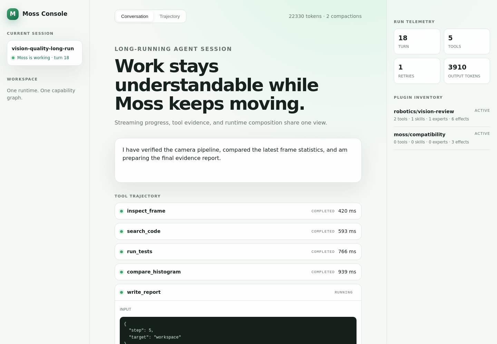

# Web console projection

Moss now provides a beta, React-free Web presentation layer at `@rdk-moss/agent/web-console`. It consumes the same `MossAgentEvent` stream returned by `streamChat()` and a redacted plugin inventory. It does not construct another agent, registry, or task state.



```ts
import { MossWebConsoleProjection, renderMossWebConsoleHtml } from '@rdk-moss/agent/web-console';

const projection = new MossWebConsoleProjection('session-1', runtime.plugins.inspect());
for await (const event of runtime.agent.streamChat('session-1', prompt)) {
  projection.apply(event);
  projection.setPlugins(runtime.plugins.inspect());
}
const html = renderMossWebConsoleHtml(projection.snapshot());
```

The standalone renderer has session navigation, conversation and trajectory landmarks, expandable tool evidence, run telemetry, and plugin inventory. It is responsive and honors reduced-motion preferences. Embedding products may serve the generated document or map the projection snapshot to their own component system.

This slice deliberately has no remote command server and does not load browser JavaScript plugins. A future ordered session protocol must add sequence numbers, history cursors, resume, gap repair, and authorization before browser control is supported.
